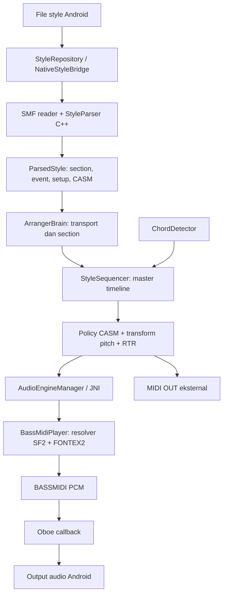

# CODEX Audit — YamahaArranger

Tanggal analisis: 30 September 2026 (UTC).

## Ruang lingkup dan metode

Analisis read-only selesai. Pada tahap analisis tidak ada file yang diubah, commit, push, merge, PR, atau workflow yang dijalankan oleh auditor. Source, history, dan hasil GitHub Actions dibaca langsung dari GitHub karena workspace lokal kosong.

Dokumen ini dibuat atas instruksi pengguna untuk menyimpan seluruh hasil analisis. Pembuatan dokumen ini tidak mengubah source code aplikasi dan tidak disertai commit, push, merge, atau PR.

Project sudah memiliki jalur arranger Android yang terintegrasi hingga audio BASSMIDI. Pengembangan terbaru berfokus pada **pemilihan voice lintas SF2**. Beberapa risiko scheduler, note lifecycle, dan konsistensi UI masih terlihat.

Temuan kode merupakan hasil inspeksi statis. Dampak audio di perangkat belum diuji dalam tahap ini. Keberhasilan build dilaporkan berdasarkan run GitHub Actions yang sudah ada; auditor tidak menjalankan build atau unit test baru. Coverage corpus dan bukti audio historis yang disebutkan berasal dari dokumentasi repository, bukan pengukuran ulang oleh auditor.

## Snapshot yang dianalisis

| Item | Hasil |
|---|---|
| Repository | `pulicarpus/YamahaArranger` |
| Branch pengembangan terbaru | `feat/voice-resolver-v2-multisf2` |
| HEAD | [`82bc5ebceffb78ff401c7d2efc32e7921c13e8bb`](https://github.com/pulicarpus/YamahaArranger/commit/82bc5ebceffb78ff401c7d2efc32e7921c13e8bb) |
| Tanggal HEAD | 30 September 2026, 15:24:19 UTC |
| Pesan commit | `ci: apply fallback load-order fix before APK build` |
| Hubungan dengan `main` | 39 commit di depan, 0 di belakang |
| HEAD `main` pembanding | `98b05f3b700d62c9fd24af46f3d5f357e98c7a2d` |

Pemilihan branch didasarkan pada tanggal HEAD seluruh branch yang tersedia, lalu dibandingkan ancestry-nya dengan `main`.

Laporan ini terikat pada snapshot HEAD di atas, bukan klaim bahwa branch yang terus berkembang tetap memiliki kondisi yang sama setelah tanggal audit.

## Struktur dan komponen utama

Aplikasi menggunakan satu module Android `app`: Kotlin 1.9.24, Jetpack Compose, Hilt, coroutine/StateFlow, Room, serta C++17 melalui JNI dan CMake. Minimum Android API 26; compile/target API 34. ABI yang dibangun adalah `arm64-v8a` dan `armeabi-v7a`.

Lokasi package tidak sepenuhnya mengikuti direktori: sebagian file di `com/yourapp/...` mendeklarasikan package `com.yourapp.yamahaarranger...`. Ini penting saat mencari implementasi atau simbol JNI.

Path Kotlin berikut relatif terhadap `app/src/main/java/`; path native relatif terhadap `app/src/main/cpp/`.

| File/komponen | Fungsi dan kondisi sekarang |
|---|---|
| `com/yourapp/ui/MainActivity.kt` | Entry point landscape, permission storage/audio, menampilkan **SxMainScreen**, inspector, dan auto-connect MIDI. |
| `com/yourapp/ui/SxMainScreen.kt` | UI aktif: LCD HOME/STYLE/VOICE, selector folder/style, RIGHT layers, mixer, release, transport, SF2 manager, log. |
| `com/yourapp/ui/MainScreen.kt` | UI alternatif yang masih dikompilasi; tidak dipanggil entry point saat ini. Memiliki komponen dialog bersama. |
| `com/yourapp/ui/MainViewModel.kt` | Menggabungkan StateFlow, menghubungkan UI dengan arranger/audio/MIDI, import style, pemilihan SF2, mixer, voice, dan diagnostic log. |
| `com/yourapp/arranger/ArrangerBrain.kt` | Routing keyboard/split, chord settle, sustain ledger, transpose, RIGHT/LEFT, pemilihan section dan Auto Fill. |
| `com/yourapp/yamahaarranger/arranger/StyleSequencer.kt` | Scheduler event style, master timeline, antrean section, policy CASM, RTR, voice setup, mixer, dan pengiriman note. |
| `com/yourapp/yamahaarranger/arranger/CasmNoteTransformer.kt` | Konversi pitch berdasarkan NTR/NTT, chord/bass, High Key, Note Limit, dan guitar fallback. |
| `com/yourapp/yamahaarranger/style/StyleRepository.kt` | Mengubah hasil parser native menjadi model Kotlin; mengambil section, PPQ, meter, event, setup voice/mixer, dan CASM. |
| `com/yourapp/style/StyleModel.kt`, `NativeStyleBridge.kt` | Model style dan kontrak JNI parser. |
| `smf_reader.cpp`, `style_parser.cpp` | Membaca SMF, marker section, setup awal, CASM `CSEG/Sdec/Ctab/Ctb2/Cntt`. |
| `com/yourapp/midi/MidiInputManager.kt` | Android MIDI IN/OUT, running status, channel filter, note, CC64, bank select dan Program Change. |
| `com/yourapp/chord/ChordDetector.kt`, `AcmpChordAnalyzer.kt` | Pengenalan chord dan inversion/slash bass; mode chord disediakan terpisah. |
| `com/yourapp/yamahaarranger/audio/AudioEngineManager.kt` | Lifecycle audio, serialisasi operasi SF2, pair/single/fallback loader, preset/mixer/release API. |
| `NativeAudioBridge.kt`, `native_lib.cpp` | Kontrak JNI audio, parser, preset, dan logger; menyimpan engine serta parsed style global. |
| `bassmidi_player.cpp/.h` | Synth aktif: SF2 normalization, resolver primary/secondary, channel mapping FONTEX2, preload, MIDI event, render PCM. |
| `audio_engine.cpp/.h` | Output Oboe stereo float 48 kHz, low latency, fallback shared stream, callback audio. |
| `soundfont_player.cpp`, folder `fluidsynth/` | Implementasi/dependency legacy yang masih ikut build; `AudioEngine` aktif memakai `BassMidiPlayer`. |
| `ContentResolverProvider.kt`, `SoundFontInspector.kt`, `Sf2StyleInspectorScreen.kt` | Akses folder/file Android dan inspeksi metadata SF2/style. |
| `data/AppDatabase.kt`, `RegistrationMemory.kt` | Fondasi Room registration memory; UI registration sekarang masih dipakai sebagai chord-test pads. |
| `.github/workflows/build.yml`, `tools/apply_*.py` | Menghasilkan APK, termasuk modifikasi source di runner sebelum kompilasi. |

`PianoKeyboard.kt` tersedia, tetapi **tidak memiliki call site pada UI sekarang**. Input performance utama berasal dari keyboard MIDI eksternal; chord pads memberi input uji melalui jalur yang sama.

## Alur Style → CASM/RTR → MIDI → BASSMIDI → audio

Parser mempertahankan event dan policy CASM. Kotlin memilih policy berdasarkan chord mask, source-note range, dan specificity; source chord root/type diperlakukan sebagai metadata pola asal.

Transformer mendukung Root Trans, Root Fixed, beberapa NTT, Bass-On, High Key, dan pemindahan octave untuk Note Limit. Dukungan gitar masih berupa fallback. RTR 0–4 sudah memiliki jalur penanganan; **RTR 5/Note Generator masih deferred**. Mode pitch-shift RTR sekarang direalisasikan sebagai NOTE_OFF/NOTE_ON pengganti, sehingga belum mempertahankan kontinuitas envelope seperti perubahan pitch pada voice yang sama.

Scheduler menggunakan coroutine `Dispatchers.Default`, `System.nanoTime()`, `delay()` dan `yield()`. Master timeline berlanjut antar-section, tetapi pengiriman event belum sample-accurate.

Event yang dihasilkan dikirim ke audio internal dan, untuk note ketika diaktifkan, MIDI OUT. BASSMIDI kemudian merender PCM melalui `BASS_ChannelGetData`; Oboe mengeluarkannya ke Android. BASS menggunakan device tanpa output sendiri karena output dimiliki Oboe.

## Pemetaan channel dan pemuatan SF2

Semua nomor internal berikut **zero-based**.

| Channel internal | Peran |
|---|---|
| 0 / 1 / 2 | RIGHT 1 / RIGHT 2 / RIGHT 3 |
| 3 | LEFT voice |
| 8 / 9 | Rhythm 1 / Rhythm 2, percussion |
| 10–15 | Bass, chord, pad/phrase accompaniment mengikuti destination CASM |

Channel 0–3 dilindungi dari jalur note style. Setup voice/mixer dan dynamic Program Change memakai destination CASM.

Bank Yamaha disimpan sebagai `MSB × 128 + LSB`. Nilai seperti `1025 = 8:1` tetap melodic; nilai bank besar tidak otomatis berarti drum.

Stack SF2 runtime dirancang sebagai **primary melody + satu secondary melody + dedicated drum**, bukan seluruh tujuh SF2 inventory. Pemilihan otomatis masih menggunakan heuristik nama file, dengan prioritas Yamaha melody/drum dan secondary Tyros/Colombo.

SF2 melody dinormalisasi menjadi salinan dengan virtual bank legal BASSMIDI. Mapping FONTEX2 mempertahankan identitas destination Yamaha dan source preset per channel. Preload memakai source bank/program hasil resolver serta `FONTLOAD_NOWAIT`.

Startup memuat SF2 sebelum membuka Oboe. Reload/import menghentikan stream sementara dan diserialisasi mutex. Enumerasi preset ditunda sampai UI memerlukannya.

## Perbedaan penting antara HEAD dan APK

[Workflow build](https://github.com/pulicarpus/YamahaArranger/blob/82bc5ebceffb78ff401c7d2efc32e7921c13e8bb/.github/workflows/build.yml) menjalankan dua script sebelum Gradle:

| Area | Source di HEAD | Source yang dikompilasi CI |
|---|---|---|
| Load SF2 | Melody → fallback → drum | Melody → drum → fallback opsional |
| Resolver primary | Semantic primary, secondary dicoba setelah primary gagal | Menambahkan perbandingan semantic primary/secondary dan category-preserving fallback |
| Alias kategori | Primary belum mengenali `horn` | Patch menambahkan alias `horn` pada primary |

Jadi **APK #752 tidak identik dengan kompilasi langsung source HEAD tanpa script tersebut**. Script melakukan string replacement yang ketat dan gagal jika blok target berubah.

Script yang berperan:

- `tools/apply_category_preserving_resolver_test.py`: memodifikasi `bassmidi_player.cpp` di runner untuk category-preserving fallback, alias `horn`, dan perbandingan semantic primary/secondary.
- `tools/apply_fallback_load_order_fix.py`: memodifikasi `AudioEngineManager.kt` di runner agar essential melody/drum pair dimuat sebelum secondary yang opsional.

## Alur keyboard, voice, sustain, dan release

MIDI IN memproses note dan CC64 pada `chordInputChannel`, default channel internal 0. Callback diteruskan oleh ViewModel ke ArrangerBrain.

Split aktual adalah MIDI note **54**:

- Di atas split: bunyikan seluruh RIGHT layer yang aktif.
- Di bawah/sama dengan split, ACMP dan LEFT aktif: masuk chord detector, dengan settle 15 ms.
- ACMP mati dan LEFT aktif: bunyikan LEFT channel 3.
- LEFT mati: lower keys diarahkan ke RIGHT layers.

RIGHT 1 aktif secara default; RIGHT 2/3 mati. Transpose menyimpan output pitch saat NOTE_ON agar NOTE_OFF tetap sesuai ketika transpose berubah.

Sustain CC64 menggunakan **ledger Kotlin** untuk menunda NOTE_OFF keyboard; chord ACMP tidak ditahan. Native `setKeyboardSustain()` sekarang hanya mencatat log. Kontrol utama Sx UI menyediakan RELEASE; fungsi toggle sustain masih tersedia di ViewModel.

Release adalah parameter 0–127, default 64, diteruskan sebagai `MIDI_EVENT_RELEASE` hanya ke channel **0–2**. LEFT dan style tidak menerima pengaturan release tersebut.

Voice picker memanggil preset API native. Label UI masih bisa berasal dari CASM/GM dan tidak selalu menunjukkan source SF2 sebenarnya. Log `VOICE RESOLVE`, `VOICE MAP`, dan `SET PRESET` lebih tepat untuk memeriksa identitas source.

## Mekanisme Main, Fill, Intro, dan Ending

- Main A–D berulang.
- Auto Fill saat berpindah Main memilih directional Fill jika tersedia; fallback-nya Fill milik target.
- Perubahan Main dihitung menuju bar berikutnya oleh ArrangerBrain, kemudian diantrekan ke master timeline sequencer.
- Saat Fill sedang berjalan, pilihan Main baru dapat mengganti antrean setelah Fill tanpa membatalkan Fill aktif.
- Intro saat playback diantrekan satu kali lalu kembali ke Main.
- Ending saat playback diantrekan satu kali lalu Stop.
- Transisi tertentu melepas note style yang tercatat tanpa global all-notes-off.
- Stop eksplisit masih memanggil all-notes-off global.

Pemilihan Intro/Ending ketika idle masih bermasalah: `startStop()` memainkan section terpilih tanpa menetapkan successor atau one-shot, sehingga berpotensi mengulang Intro/Ending terus.

## History yang perlu dijaga

History branch serta history per-file engine ditelusuri. Perubahan berikut sudah terdapat pada jalur terbaru dan perlu menjadi batas regression:

| Commit | Perubahan yang sudah masuk |
|---|---|
| `eec7d90` | CASM range dan source metadata selection. |
| `6532ad9` | Cache preset/mixer untuk mengurangi mutasi saat Fill→Main. |
| `a2db997` | Preload SF2 menggunakan NOWAIT. |
| `4445017`, `0c0dcbe` | Pelestarian Yamaha bank dan flag FONTEX2. |
| `520e4ba` | `BASS_MIDI_NOTEOFF1` untuk overlapping native notes. |
| `123dc1f`, `05803c3` | Sustain ledger dan release sebagai parameter terpisah. |
| `bb203f6` | Semantic voice matching sebelum fallback numeric lintas bank. |
| `43820fe`, `4b682f4` | Directional Fill, termasuk marker `Fill In BA`. |
| `eeda75f`, `3a6c8d3`, `1db6cc5` | Mapping resolver per channel dan preload source preset terpilih. |
| `291079c` | Revert percobaan koreksi GM category; koreksinya belum menjadi implementasi final. |
| `e69d3d9`, `82bc5eb` | Safety load-order melalui patch CI. |

Branch eksperimen async MIDI dan callback nonblocking memang ada, tetapi **HEAD yang dianalisis masih menggunakan event sinkron dan mutex render blocking**. Nama branch perbaikan tidak membuktikan perubahan tersebut sudah diintegrasikan.

Catatan audit lama perlu dibaca bersama implementasi dan history terbaru agar perubahan yang sudah masuk tidak diperbaiki ulang atau dirusak. Khususnya, directional Fill sudah ditambahkan; sustain ledger dan release adalah jalur berbeda; normalization bank, FONTEX2, NOTEOFF1, serta source-preset preload perlu dipertahankan selama regression.

## Risiko dan pekerjaan yang belum selesai

Temuan berikut berasal dari pembacaan kode; dampak audio di perangkat belum diuji dalam tahap ini.

| Area | Temuan |
|---|---|
| Realtime audio | `render()` memakai mutex yang sama dengan note, preset, mapping, preload, dan enumerasi preset. Callback dapat menunggu operasi kontrol/file; kandidat dropout yang perlu diukur. |
| Note ownership style | Identitas masih `sourceChannel:sourceNote`. Note overlap dari track/instance berbeda dapat saling menggantikan. `NOTEOFF1` native belum menyelesaikan ownership Kotlin. |
| RIGHT layer dimatikan | Toggle hanya mengubah enabled flag; NOTE_OFF juga melewati layer yang sudah disabled. Note yang sedang dipegang dapat tidak dilepas. |
| Drum | Setup/native mengenali channel 8 dan 9, tetapi `isDrumPart` pada konversi note hanya eksplisit memeriksa 9 atau nama drum. Channel 8 bergantung nama policy untuk menghindari transposisi. |
| MIDI OUT | NOTE_ON/OFF menghormati toggle; Program Change dan all-notes-off tidak. Sebagian UI mengirim packed bank sebagai MSB sehingga ter-clamp dan LSB hilang. |
| Mixer/voice override | Sx mixer memakai setter voice langsung, berbeda dari setter override sequencer. Section berikutnya dapat menimpa pilihan. `override.bank` juga belum dipakai saat setup section. |
| Dynamic setup | Dynamic Program Change tidak membawa voice name; dynamic CC dapat menimpa volume override. |
| Resolver | GM category ranges masih tidak tepat, misalnya PC 8–15 dianggap Organ. Patch primary tidak menyamakan resolver secondary; secondary masih memiliki final Piano fallback untuk request non-piano. |
| SF2 lifecycle | SF2 manager reload pair tanpa memasang kembali secondary. Multi-file tanpa preferred pair dapat tidak auto-load. Status Kotlin memakai flag yang dapat tertinggal saat load parsial gagal. |
| Parsing concurrent | `g_lastParsedStyle` global tanpa guard untuk keseluruhan parse/read. Pemilihan style cepat dapat beririsan. |
| Scheduler | State mutable dibagi antara input/UI dan playback thread; perubahan tempo belum merebase clock. Batas section dan section tanpa event perlu regression. |
| Parser marker | Directional Fill sudah ditambahkan, tetapi `Fill AB` dapat lebih dulu dikenali sebagai FillAA; format `Fill In AB` masuk jalur directional. |
| Test | Test CASM memiliki assertion lama yang bertentangan dengan transformer sekarang: dua input identik mengharapkan output berbeda; Note Limit test mengharapkan mute padahal implementasi memindahkan octave. |
| Fitur UI | Sync Start dan Tap Tempo kosong; save registration hanya log; multipad masih tampilan statis. Label split default UI `C4` berbeda dari split aktual 54. |
| Dokumentasi | Audit lama masih menyebut directional Fill belum tersedia dan komentar tertentu masih menyebut FluidSynth sebagai engine aktif. |

### Coverage dan fidelity SF2

Coverage SF2 belum menjamin fidelity Yamaha. Snapshot terbaru dalam repository mencatat:

- 569 style.
- 7.612 voice setup entries.
- 578 request Yamaha bank/program unik.
- Inventory tujuh SF2 dengan 1.624 preset yang diinspeksi.
- 25 exact packed-bank + program.
- 204 tambahan same-MSB + program.
- 349 same-PC-only.
- 0 request tanpa kecocokan program di mana pun pada inventory tersebut.

Angka ini berbeda dari snapshot sebelumnya, yang mencatat 250 same-MSB+program dan 328 same-PC-only, dan belum direkonsiliasi. Same-PC-only tidak boleh diperlakukan sebagai bukti kecocokan voice yang aman.

MSB 104 tetap keluarga terbesar tanpa same-MSB coverage: 282 request unik dan 2.342 voice entries. Masalah ini membutuhkan voice-family/variation mapping dan kualitas source SF2, bukan sekadar normalisasi bank tambahan.

Dokumentasi runtime sebelumnya mencatat Bass dapat resolve ke source `BASS`, Piano ke `Yamaha ConcertGrand`, Guitar ke `Steel Guitar`, sementara Strings1/Strings2 dapat berakhir pada source preset yang sama. Label UI seperti `B3 Org` tidak cukup untuk menyimpulkan source native adalah Organ. Source identity native dan mute-per-channel menjadi bukti yang perlu dipakai dalam regression berikutnya.

Data coverage dan bukti runtime historis tersebut berasal dari catatan audit repository, bukan pengujian ulang corpus atau perangkat oleh auditor.

## Kondisi workflow APK

[Build #752](https://github.com/pulicarpus/YamahaArranger/actions/runs/36736476646) untuk HEAD berhasil pada 30 September 2026:

- Kedua patch source berhasil.
- Gradle `assembleDebug` berhasil.
- Artifact `app-debug` tersedia dan belum expired pada saat audit; ZIP sekitar 12,4 MB.
- Langkah Telegram pada run tersebut dilaporkan berhasil.

Toolchain: JDK 17, Gradle 8.7, AGP 8.5.2, NDK r26d, CMake 3.22.1. BASS/BASSMIDI diunduh saat CI; header dan library-nya tidak lengkap dalam source snapshot.

Workflow aktif pada push ke daftar branch tertentu dan manual dispatch. **Tidak ada trigger PR, unit test, lint, atau instrumented test pada workflow sekarang.** SDK download tidak dipin checksum; build juga belum memakai Gradle wrapper. Keberhasilan ini membuktikan APK dapat dibangun melalui pipeline tersebut, belum membuktikan runtime musikal bebas regression.

Pipeline build meliputi checkout, patch resolver, patch load-order, setup toolchain Android, download BASS/BASSMIDI, kompilasi debug, upload artifact, dan pengiriman Telegram. Pengiriman Telegram memiliki `continue-on-error: true`, sehingga status build hijau secara umum tidak selalu membuktikan pengiriman berhasil; untuk run #752, step tersebut memang dilaporkan success.

Workflow terpisah `.github/workflows/inspect-sf2.yml` berjalan melalui manual dispatch, menerima URL SF2, mengunduhnya, menjalankan `tools/sf2_inspector.py`, dan mengunggah laporan. Workflow ini menghasilkan laporan metadata, bukan APK.

Tidak ada workflow yang dipicu atau diulang oleh auditor.

## Rekomendasi urutan pekerjaan setelah persetujuan

1. **Tetapkan baseline yang dapat direproduksi:** HEAD, dua patch CI, APK #752, inventory SF2, dan style uji yang sama.
2. **Rekam regression baseline:** Love Song Main D, mute tiap channel, drum+melody, RIGHT 1/2/3, LEFT, sustain/release, seluruh transisi, serta meter berbeda.
3. **Rekonsiliasi source dengan kode hasil patch CI dan benahi dasar pengujian CASM** sebelum mengubah engine.
4. **Lanjutkan resolver sesuai fokus branch:** category rules, secondary fallback, MSB104/variation, dan source identity. Pertahankan routing drum dan timing selama pekerjaan ini.
5. **Tangani note lifecycle:** instance ownership, RIGHT toggle, mode/split changes, dan keseimbangan NOTE_ON/OFF.
6. **Ukur contention callback**, lalu lakukan isolasi realtime dengan regression yang sama.
7. **Rapikan transport idle Intro/Ending, tempo/quantize, override mixer/voice, dan konsistensi MIDI OUT.**
8. **Setelah engine stabil**, lanjutkan registration, Sync Start/Tap Tempo, serta pembersihan legacy dan dokumentasi.

Semua rekomendasi masih berupa pemetaan. **Belum ada perbaikan source yang diterapkan; perubahan source berikutnya menunggu persetujuan pengguna.**
