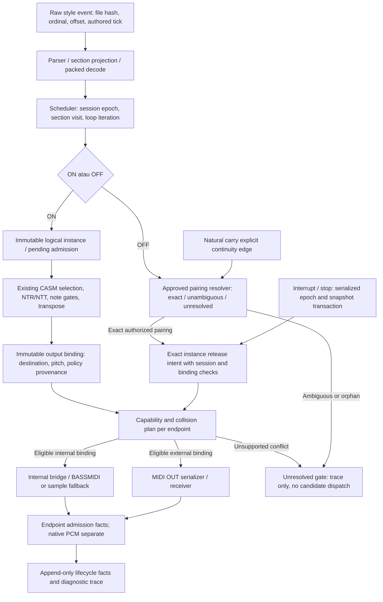

# F03 Architecture Decision Gate — YamahaArranger

## Ringkasan keputusan

**GO untuk rancangan dan, setelah persetujuan terpisah, prototype test-only.
NO-GO untuk perubahan playback saat ini.** Representasi satu-slot source/key
harus dipisahkan dari identity instance, pairing authored OFF, admission tiap
output, dan kemampuan release backend. Mengganti map dengan FIFO saja belum aman.
Dokumen ini tidak memberi izin implementasi atau memilih FIFO sebagai Yamaha oracle.

Branch `fix/mix-percussion-fidelity-784`. HEAD lokal dan remote sebelum penulisan
sama: `12304d813c16c6c4fef44b3311b936051b47b01d` (baseline akhir S8), working tree
bersih. Parent `517b784ded77ec9d997b2a6ec61201250752eaa6` adalah source/test commit
[Build #804 SUCCESS](https://github.com/pulicarpus/YamahaArranger/actions/runs/37763724067).
Tree baseline akhir S8: `6fa23657354d0727c63e6bdabdab63f206f20281`.
Seluruh 363 berkas tracked baseline dibekukan untuk pemeriksaan byte-identical
sebelum push. Perubahan gate ini hanya dokumen ini; tanpa produksi, workflow,
fixture, golden, Stage 3 atau perilaku playback. Audit S1–S8 tidak dijalankan ulang.

Keputusan model di bawah adalah **proposal arsitektur**; status PROVEN hanya
melekat pada bukti, bukan otomatis pada intended behavior Yamaha atau rancangan.
BLOCKED berarti syarat keputusan/implementasi belum terpenuhi; UNKNOWN berarti
perilaku belum diketahui. Invarian bookkeeping dapat dipilih tanpa mengarang
pairing musikal, tetapi dispatch yang berubah tetap membutuhkan approval/gates.

## Bukti tersimpan dan batasnya

| ID | Sumber yang dibaca | Bukti yang boleh digunakan |
| --- | --- | --- |
| E5 | [S5 report](F03_NOTE_OWNERSHIP_INVESTIGATION_S5.md), [raw ownership reference](../tests/fixtures/f03_ownership_reference_s5.json), [inventory](../tests/fixtures/f03_overlap_inventory_s5.csv), [dispatch summary](../tests/fixtures/f03_dispatch_summary_s5.json), [1046 traces](../tests/fixtures/f03_dispatch_trace_s5.txt), [preservation](../tests/fixtures/f03_preservation_reference_s5.json) | 523 overlaps/47 styles, 276 replacements, 31 strict shortened dispatch witnesses relatif FIFO observer; bukan 523 audio failures |
| E6 | [S6 report](S6_F03_ROOT_CAUSE.md), [fixture](../tests/fixtures/s6_f03_evidence.json) | First divergence replacement sebelum transform; scheduled OFF memakai current source/key slot. Natural carry control, interrupted snapshot cleanup, explicit stale-OFF injection; spontaneous race UNKNOWN |
| E7 | [S7 report](S7_F03_BACKEND_CONTRACT.md), [contract fixture](../tests/fixtures/s7_contract_evidence.json) | FIFO/LIFO/count/retrigger merupakan model, pairing approval false. Native/external OFF kehilangan logical source identity; dispatch bukan suara perangkat |
| E8 | [S8 report](S8_F03_NATIVE_VOICE_EVIDENCE.md), [raw native evidence](../tests/fixtures/s8_native_evidence.json), [CI evidence](s8_ci_evidence.json), [integrity](../tests/fixtures/s8_integrity_evidence.json) | SDK Linux nyata: overlap A+B, signature B bertahan sesudah first OFF pada empat source/OFF-order trials. Tail A menjelaskan classifier S7 UNKNOWN melalui fit error0; long-release identity tetap UNKNOWN |

S8 SDK BASS `0x02041203`, BASSMIDI `0x02041000`, header/library hashes ada di E8.
A lebih tua/v48/375Hz dan B lebih muda/v112/1125Hz. Reverse ON order/signature
assignment belum disertifikasi; jangan menggeneralisasi FIFO universal. Native
handle tidak diobservasi. Angka S7 di E8 adalah rerun lokal frozen source, bukan
isi artefak Build #802 yang belum terbaca. Android runtime/PSR-E343 UNRUN.

Kontrak Yamaha yang **terbukti oleh bukti tersedia: tidak ada kontrak pairing
instance NOTE_OFF untuk overlap ambigu yang dapat disertifikasi**. Preservation
raw events/CASM descriptors membuktikan data dipertahankan, bukan Yamaha intent.
S5 case007 EndingB source11/key67: ON ticks2880/4800, OFF4920/9100; produksi
menambah OFF2880-owner di4800 dan mengakhiri4800-owner di4920. FIFO expected
interval adalah observer hypothesis; jangan menjadikannya golden Yamaha.

## Lifecycle ownership: existing boundary dan proposed separation

Ini diagram proposal, bukan pipeline yang sudah diimplementasikan. Existing
map pada `StyleSequencer.playOnce`969–989 mengganti owner dan mengirim early OFF;
`endScheduledNote`549–550 memilih current slot. Existing CASM/scheduler/comparator
serta output routing tetap authoritative sampai perubahan terpisah disetujui.
Boundary lain: `StyleRepository.decodePackedEvents`, `CasmNoteTransformer`,
`AudioEngineManager` → JNI/native_lib → audio_engine → BassMidiPlayer, dan
`MidiInputManager.sendNoteOn/sendNoteOff`. Destination/pitch OFF native dan
external tidak membawa InstanceId. Sample fallback memiliki pitch-wide release;
percussion adapter mempunyai accounting terpisah. Jangan menggabungkan ketiganya.

## Desain logical instance dan backend accounting

### D1 — Identity immutable, state berupa facts; proposal untuk approval

`InstanceId = (sessionEpoch, styleContentHash, sectionVisitId, iterationId,
ON-event identity, occurrenceSerial)`. ON-event identity mencakup raw ordinal/
offset bila tersedia, source channel/key, authored tick dan provenance projection.
Occurrence serial membedakan replay/duplikat; tick, key atau diagnostic onId saja
bukan identity. SectionVisitId monoton pada setiap kunjungan section, termasuk
kunjungan ulang ke Main yang sama; iterationId monoton per loop visit, bukan nama
section atau tick modulo. SessionEpoch berubah pada stop/restart/style reload
atau reset session yang disetujui, bukan pada natural boundary biasa.

Record immutable menyimpan section/part, source identity, projected tick dan
scheduled absolute tick, policy descriptor/binding provenance, chord snapshot
version dan parent causal event. Bila raw offset/ordinal tidak tersedia pada
production packed format, gunakan decoded event index + style/section content
identity dan tandai provenance unavailable; **jangan mengarang raw provenance
atau mengubah parser/packed ABI hanya untuk fase pertama**. Kelengkapan ini adalah
syarat verifikasi sebelum mengklaim instance end-to-end berasal dari raw ordinal.

Destination/pitch tidak dimasukkan sebagai satu nilai yang bisa dimutasi di
InstanceId. Gunakan immutable `BindingId = (InstanceId, routeRevision, endpoint,
outputEpoch, destinationChannel, outputPitch)` beserta port/stream identity,
policy/chord snapshot dan ON dispatch identity. Retarget menghasilkan binding
baru melalui release-old/admit-new transaction yang mempertahankan InstanceId
musikal serta mengaitkan causal RTR event. OFF memilih exact instance lalu binding
live yang sah, bukan destination dari incoming OFF policy atau object lama.

Admission bukan boolean pada identity yang dimutasi. Simpan immutable facts
`CREATED`, `POLICY_REJECTED`, `SUBMITTED`, `NATIVE_ACCEPTED`, `NATIVE_REJECTED`,
`ADMISSION_UNKNOWN`, `RELEASE_INTENT`, `RELEASE_SUBMITTED`, `RELEASE_FAILED`,
`CANCELLED_BEFORE_SUBMIT`, `LOGICALLY_TERMINATED`. Projector menghasilkan state
terkini. Setiap endpoint punya state sendiri; INTERNAL accepted tidak berarti
MIDI receiver accepted. Existing internal API return void, external send juga
bukan receiver acknowledgment: prototype harus mempertahankan UNKNOWN, bukan
memalsukan NATIVE_ACCEPTED. Receipt API/internal contract baru butuh approval.

Rejected attempt/tombstone tetap tersimpan sebagai causal event. Hanya OFF yang
pairing-nya memang diketahui menuju rejected instance boleh dikonsumsi tanpa
wire OFF. Jika authored OFF tidak mengidentifikasi instance, tombstone tidak
membenarkan menebak queue atau melewati rejected ON lalu mengambil admitted B.

**Bukti:** E5/E6 collisions dan stale lookup; E8 family gate rejected sebelum
native ON. **Asumsi:** availability decoded index/lifetime policy binding perlu
verifikasi saat prototype. **Risiko musikal:** identity/provenance salah dapat
mengubah release setelah retarget/carry. **Backend:** binding immutable bukan
selective native handle. **Tes wajib:** G1–G4 di bawah, duplicate ticks/indices,
retarget old binding, independent endpoint receipts. **STOP:** identity alias,
provenance fabricated, admission UNKNOWN dipromosikan menjadi accepted, atau
perlu perubahan parser/CASM/timing yang belum disetujui.

### D2 — Pairing policy explicit; overlap Yamaha BLOCKED

OFF memiliki `OffEventId`/provenance dan execution ticket sendiri. Resolver
menghasilkan `EXACT(instance)`, `UNAMBIGUOUS_UNDER_APPROVED_SCOPE(instance)`,
`AMBIGUOUS(candidates, reason)` atau `ORPHAN`. Authored MIDI key-based OFF tidak
memiliki InstanceId dengan sendirinya. Singleton matching tetap membutuhkan
scope source/key, authorized visit/iteration continuity, session epoch dan
rejection history; satu admitted owner saja belum cukup jika ada rejected attempt.

FIFO/LIFO boleh menjadi alternatif model test-only; tidak default production.
Same-tick comparator F02 tetap baseline. Jangan mencari pasangan dengan
urut dispatch hasil candidate lalu memakai hasil itu sebagai oracle Yamaha.
Cross-boundary pairing memerlukan approved continuity edge; jangan otomatis
mengikat semua OFF baru ke notes section lama atau membuang semua cross-section
OFF. OFF resolution tidak boleh memilih current slot karena kebetulan key sama.

**Bukti:** E5 raw OFF tanpa token, 31 FIFO-relative witnesses; E6 intentional
carry dan injected stale OFF; E7 pairing approval false. **Asumsi:** authored
FIFO/LIFO, loop-wrap pairing dan cross-section intent UNKNOWN. **Risiko musikal:**
pairing salah memotong attack/duration atau membuat stuck note. **Backend:**
logical exactness masih belum menjamin native selection. **Tes:** G2/G3/G6;
paired reference dari bukti Yamaha independen, rejected/ambiguous OFF controls.
**STOP:** candidate ambiguity tidak terselesaikan, oracle circular, atau hanya
FIFO-model PASS dipakai untuk membuka playback. Unresolved case tetap BLOCKED.

### D3 — Per-output collision ledger, bukan physical voice counter

`OutputKey = (endpoint kind, port/stream identity, outputEpoch, destination,pitch)`;
untuk fallback pitch-wide backend gunakan conflict domain sebenarnya, bukan
channel/pitch palsu. Accounting menyimpan multiset BindingIds dari semua sources,
sections dan routes, submission order/receipts, release intents dan capability
profile yang certified. Satu instance bisa memiliki dua binding INTERNAL/MIDI_OUT.
Reserve/check → submit → receipt update dipisahkan; serialization/lock discipline
harus membuat admission, retarget dan cleanup tidak kehilangan reservation.

Setiap submission mempunyai IntentId yang unik pada BindingId/endpoint; receipt
unknown tidak membolehkan retry ON/OFF otomatis. Partial success INTERNAL versus
MIDI_OUT tetap dua facts berbeda: jangan undo/replay output yang sudah accepted
untuk menutupi kegagalan endpoint lain. Deduplication dan recovery setelah
unknown transport outcome harus menjadi approved contract dengan tests sendiri.

Counts adalah jumlah logical/submitted/accepted bindings masing-masing, **bukan
native voice count atau jumlah audible voices**. Accepted OFF hanya command
acceptance; release tail tetap mungkin. Jangan menghapus pending/unknown binding
sebagai bukti native voice mati. Retire accounting melalui release fact atau
explicit terminated session/output domain, mempertahankan historical UNKNOWN.
New ON ke shared output tidak otomatis menutup binding lama.

**Bukti:** E5 cross-source owners; E7 packets kehilangan source; E8 sustained B
plus A tail. **Asumsi:** backend/channel capabilities dan genuine rejection
UNKNOWN pada target devices. **Risiko:** double OFF, ghost logical counts, stale
port identity, queue leak/voice stealing. **Backend:** independent ledgers untuk
native melody, percussion adapter, sample fallback, external MIDI; jangan
mengganti percussion queue dengan melodic queue. **Tes:** G3–G5, concurrent
reserve/release, same-output/different-source, disconnected/reopened port,
resource bounds and unknown receipts. **STOP:** count disamakan dengan PCM,
endpoint receipts digabung, lost reservation, atau kapasitas/overflow tidak punya
approved policy. Jangan evict live owner diam-diam untuk menjaga memory bound.

### D4 — Backend tanpa selective release: NO implicit substitution

Capability profile default UNKNOWN dan dibatasi backend binary/hash, route,
font/voice mode, device dan tested scope. Profile selective harus punya actual
handle + tests; profile nonselective hanya eligible bila requested release
terbukti selaras dengan certified allocation order pada seluruh live conflict
set. S8 Linux profile baru merupakan observation dua notes, bukan general FIFO
profile yang telah certified untuk production Android.

Bila intended B bukan native-selectable victim, jangan mengirim OFF A sambil
menandai B selesai. Jangan menunda OFF, suppress ON/OFF, coalesce/refcount,
retrigger, all-off lalu replay, channel-split atau steal sebagai default terselubung.
Semua mengubah lifetime, attack, controllers, routing atau timbre dan memerlukan
proposal musikal serta persetujuan khusus. Receiver MIDI UNKNOWN tidak boleh
memakai capability Linux. Internal supported / MIDI unsupported tetap BLOCKED
untuk mode dual-output; jangan diam-diam menonaktifkan MIDI OUT.

Untuk prototype, hasil unresolved adalah trace conflict tanpa output mutation.
Untuk future opt-in production rollout, preflight scope/capability harus menolak
session sebelum candidate dispatch dimulai; pilih entire S8 baseline dari awal.
Baseline fallback tidak menyelesaikan F03 dan harus dilaporkan demikian. Jika
unexpected conflict muncul setelah candidate sudah mengirim ON, **tidak ada
fallback live yang disetujui**. Hentikan eksperimen terkontrol melalui explicit
approved session-abort/reset procedure, tandai failure; jangan switch registry
mid-note atau melanjutkan dispatch salah sasaran. Default production activation
BLOCKED sampai runtime conflict/abort policy disetujui dan diuji.

**Bukti:** E7 alternatif model mengubah attack/lifetime; E8 OFF B tetap menyisakan
B, no selective token. **Asumsi:** universal allocation, Android/PSR behavior
UNKNOWN. **Risiko musikal:** abort memutus accompaniment; fallback mempertahankan
bug S8. **Backend:** selective-release mismatch tak bisa diperbaiki hanya oleh
logical queue. **Tes:** G4–G7; all source convergences and capability denial.
**STOP:** release victim tidak bisa dibuktikan, required output unsupported,
conflict/runtime policy belum approved, atau silent musical substitution.

## Matriks skenario collision dan pairing

Status berikut menyatakan gate rancangan, bukan bahwa playback telah diperbaiki.
Semua row mewarisi keputusan/test/STOP D1–D7 dan G1–G7 yang dirujuk.

| Skenario | Logical decision / pairing | Backend decision | Gate / bukti / tes |
| --- | --- | --- | --- |
| Satu ON, exact authorized OFF | Release InstanceId + live BindingId | Submit hanya untuk admitted/known scope; UNKNOWN admission tidak dianggap voice | Candidate setelah approval; E5; D1–D3/G2 |
| Source/key sama, dua ON, OFF ambigu | Retain dua instances; resolver AMBIGUOUS, FIFO/LIFO model-only | Tidak menambah early replacement OFF | Yamaha pairing BLOCKED; E5/E6; D2/G2 |
| Dua sources → dst/pitch sama, desired OFF oldest | Per-source intent dan global output set terpisah | Eligible hanya jika certified native victim selaras | Android/PSR BLOCKED; E8 scoped observation; D3/D4/G4 |
| Dua sources → sama output, desired OFF younger | Exact logical B belum selective native B | Tidak substitute OFF A; unsupported conflict | BLOCKED; E8 empat trials; D4/G4 |
| Dua sources, berbeda destination/pitch | Conflict domain terpisah bila backend memang channel-aware | Independent bindings, bukan pitch-only fallback | Scope-specific; E5 negative control; D3/G3/G4 |
| Rejected A lalu admitted B, OFF A | No wire OFF hanya dengan exact approved pairing ke A | B tidak dikonsumsi; genuine admission status perlu receipt | Ambiguous authored OFF BLOCKED; E7/E8 injection; D1/D2/G2/G4 |
| Natural section/loop boundary | Same session, retained instance; explicit continuity edge | Binding tidak dibersihkan karena nama section berubah | Yamaha carry scope UNKNOWN; E6 control; D5/G3/G6 |
| Interrupted Main/Fill | Freeze scheduling authority dan snapshot seluruh live eligible instances | Release tiap exact binding under certified conflict plan | Cleanup contract approval; E6 snapshot bukan outgoing-section-only; D5/G3/G4 |
| Old scheduled OFF sesudah restart | Old session ticket invalid sebelum lookup/send | Tidak menyentuh new output domain | Invariant candidate; race lapangan UNKNOWN; E6; D5/G3 |
| Orphan OFF | Trace ORPHAN; tidak pilih newest key slot | Tidak forward tanpa certified authored/backend rule | Yamaha unmatched-OFF policy UNKNOWN; E5; D6/G2/G6 |
| RTR/chord retarget | Same musical instance, immutable new binding revision | Release old/admit new transaction, collision rechecked | Semantics RTR baseline saja; D7/G3/G6 |
| MIDI disabled/disconnected/reopened | Endpoint-specific not submitted/unknown receipt; port epoch baru | Tidak menganggap reconnect sebagai restoration suara | Device lifecycle UNKNOWN; E7; D3/D5/G5/G7 |

## Kebijakan section/session generation dan cleanup

### D5 — Execution authority berbeda dari carry identity

Execution ticket berisi SessionEpoch, SectionVisitId, IterationId, plan revision
serta OffEventId/causal intent. Ticket lama tidak memperoleh authority dengan
mencari owner pada source/key baru. Validasi epoch/ticket, pairing, binding
revision dan endpoint epoch harus berada dalam serialized transition/dispatch
transaction; check lalu send tanpa serialization masih menyisakan race.
Cancellation alone bukan generation guard atau bukti scheduler thread berhenti.

Natural boundary tidak menaikkan SessionEpoch. Section visit/loop iteration baru
mencegah alias identity, tetapi authorized carry tetap mengacu instance/binding
lama. OFF di section baru boleh merilis carry hanya lewat explicit approved
continuity relation; task lama dan new-section authored carry-OFF adalah dua
hal berbeda. Ticket dari visit lama boleh tetap sah hanya jika explicit continuity
authorizes exact release intent dalam epoch yang masih live; equality dengan
active visit bukan satu-satunya validity rule. Loop-wrap tidak diasumsikan legal
carry tanpa bukti authored pairing.

Interrupted transition: bekukan authority untuk work outgoing, ambil snapshot
instances di serialized boundary **sebelum incoming ON**, release snapshot sesuai
backend conflict plan, kemudian incoming memperoleh visit baru. Snapshot baseline
mencakup seluruh active owners termasuk carry, bukan sekadar sourceSection lama.
Mempersempit cleanup menjadi outgoing-only adalah perubahan baru yang BLOCKED.
Tasks captured snapshot hanya boleh mengacu exact IDs/revisions, bukan key lookup.

Stop/restart: invalidate session authority dahulu, cancel/drain work terurut,
jalankan existing scope stop/reset sesuai approved endpoint policy, close ledger
sebagai session terminated (physical silence belum diasumsikan), baru permit new
SessionEpoch/output epochs. Jangan mengulang delayed cleanup epoch lama pada
stream/port yang sudah dipakai session baru. Stop CC123/native all-off behavior
baseline tetap, termasuk existing external stop flag behavior; perubahan terhadap
semantik itu di luar F03. Device PCM harus membuktikan cleanup tails/sustain.

**Bukti:** E6 carry dan cleanup controls, stale injection; E5 stop dan object
identity guard. **Asumsi:** real race dan Yamaha carry scope UNKNOWN. **Risiko:**
hilang carry, double cleanup, release incoming section, stop tail/stuck note.
**Backend:** snapshot cleanup juga dibatasi nonselective conflicts dan output
epoch; broad panic bukan selective instance release. **Tes:** G3/G4/G6/G7,
transition barrier, in-flight ack, old OFF after restart, retained carry across
multiple visits. **STOP:** incoming bisa overlap cleanup epoch lama, blanket
cross-section OFF drop, snapshot membership diubah, atau real-clock correctness
diklaim dari injection saja.

### D6 — Orphan, rejected dan overflow tidak disamarkan

Record orphan/rejected/ambiguous terpisah; jangan menyamakan 518 orphan S5 dengan
518 bugs. Preserve policy-rejected dan rhythm/no-owner distinction. Orphan tidak
otomatis forward atau drop sebagai Yamaha contract; hingga disertifikasi,
production tetap baseline, prototype mengembalikan unresolved trace. Batas memory
per session/ledger harus meliputi live bindings, rejected history dan carry;
retire hanya saat continuity/pairing tak lagi membutuhkannya. Overflow menjadi
explicit gate failure, bukan owner eviction. Threshold dan runtime abort policy
memerlukan approval, tidak ditentukan dengan angka yang dikarang.

**Bukti:** E5 56 policy rejection dan overlapping orphan categories; E8 false
reference akibat family gate. **Asumsi:** unmatched OFF intent / backend genuine
rejection UNKNOWN. **Risiko:** orphan wrong-release, tombstone leak, overflow
abort memotong musik. **Backend:** POLICY_REJECTED != NATIVE_REJECTED != device
receiver unknown. **Tes:** G2/G3/G4, missing/duplicate OFF, admission timeout,
resource exhaustion, long loops. **STOP:** reject diperlakukan admitted, skip
rejected queue menarget B, orphan memilih live key, atau silent eviction.

### D7 — Pertahankan semantics musikal, isolasikan scope

| Domain | Batas rancangan dan risiko yang wajib diuji |
| --- | --- |
| CASM SFF1/SFF2, NTR/NTT/high-key/note limits | Existing selector/transform authoritative; simpan descriptor provenance dan output actual. Jangan memperbaiki F01 mask/root-selection atau mengubah packed format. SFF1 corpus503 bukan SFF2 certification |
| RTR/chord recognition/no-chord | Existing RTR0 termination,1–4 replacement variants,5 deferred tetap. Chord snapshot/version dicatat; retarget semua eligible instances memerlukan approved delta dan collision plan. Recognition/hold semantics tidak diubah |
| Rhythm/drum/percussion/one-shot | Existing native queue/choke/adapter domain terpisah. Jangan membuat scheduled melodic OFF untuk rhythm atau memperbaiki F05. Decaying one-shot bukan logical release oracle |
| ACMP/keyboard/sustain/transpose | Baseline ACMP-off retained style owner adalah observation; jangan mengubah chord reset/LEFT keyboard ledger sebagai efek F03. Keyboard ownership domain terpisah. Sustain tail berbeda dari active key |
| Main/Fill/Intro/Ending, loop/phase | Visit identities unik tanpa mengubah queue/phase/timing. Preserve natural carry dan interrupted snapshot. MainD→FillBB→FillAA→MainA serta variasi S6 wajib; F02 same-tick/F12 boundary tidak dibundel |
| MIDI OUT/sample fallback | Receiver capability UNKNOWN; channel/key packet tidak selective. Fallback pitch-wide release tidak boleh memakai melodic channel isolation palsu. Dual-output bisa berbeda admission/voice allocation |

**Bukti:** E5 complete boundary map/A–J, E6 distinctions, E7 serializer, E8 real
family gate. **Asumsi:** Yamaha musical intent/device equivalence belum tersedia.
**Risiko:** chord articulation, rhythm choke, phase, keyboard isolation dan
controller reset berubah. **Backend:** retarget/controller/mode/font changes
mengubah conflict domain/capability scope. **Tes:** G1/G3/G5–G7 semua domain di
matriks. **STOP:** non-F03 musical delta, CASM/scheduler/recognition/rhythm repair,
gain/font/routing perubahan terselubung, Stage3 aktivasi atau golden rewrite.

## Rencana implementasi bertahap — setiap tahap perlu persetujuan

| Tahap | Batas perubahan yang diusulkan | Gate sebelum maju / STOP |
| --- | --- | --- |
| P0: approval arsitektur + test-only prototype | Pure instance/binding/facts dan unresolved-pairing resolver di isolated tests, consuming fixture tersimpan; tanpa production hook/API/backend writes | Approve D1–D3 dan model hypotheses; Technical invariant subsets G1/G2/G3 PASS; Yamaha pairing portions tetap BLOCKED dan ambiguity harus muncul eksplisit; stop bila model expected berasal dari dirinya sendiri atau ambiguity disamarkan |
| P1: lengkapi external evidence | Certified Yamaha pairing/carry captures, Android native/PCM dan PSR captures; pin binary/SF2 hashes, reversed ON/signatures, sustain/layer/stealing/collisions | G4/G6/G7; UNKNOWN/BLOCKED tidak membuka scope; native handles/counts/PCM dibedakan |
| P2: explicit proposal production accounting-only | Narrow identity/receipt/ticket propagation dan shadow ledger pada approved boundary; actual dispatch source of truth. Existing dispatcher authoritative, output transcripts wajib identik | Approval baru sebelum produksi; G1–G7 untuk approved scope, overhead bounded, zero output delta; stop on latency/locking/ABI or musical changes |
| P3: opt-in release changes pada certified subset | Ganti satu-slot hanya untuk scope whose authored pairing, admission dan backend release cocok; allowlist/session preflight, no live partial fallback | Full pairing/backend/device/corpus gates; immutable binding retarget/carry verified; explicit expected F03 deltas independent oracle; stop unsupported collision atau receipt UNKNOWN |
| P4: broaden scope individually | Cross-source/nonselective/multi-output/rhythm fallback hanya lewat separate policy decision and approval | Tidak otomatis meluas dari P3 atau ke S9; tiap endpoint/domain memiliki gates/rollback sendiri |

P0 adalah **implementasi pertama paling aman** setelah approval: test-only
prototype terhadap existing fixtures, dengan AMBIGUOUS sebagai hasil sah.
Bukan production FIFO queue. P2/P3 bukan diizinkan oleh dokumen ini. Gate lengkap
untuk perubahan playback masih BLOCKED; jangan membuka P3 hanya karena P0 PASS.
Implementation units harus kecil/reviewable; jangan mengganti parser, CASM,
scheduler ordering, mixer, SF2 resolver, routing dan backend allocation sekaligus.

## Acceptance gates dan stop criteria

Semua gate menyimpan input/hash, expected oracle provenance, actual output,
classification dan PASS/FAIL/BLOCKED/UNRUN. UNKNOWN identity tetap UNKNOWN meski
execution sanity PASS. Tidak boleh zero-test/skip counts menjadi certification.

| Gate | Acceptance yang diperlukan | Bukti saat gate keputusan ini / STOP |
| --- | --- | --- |
| G1 integrity/regression | Semua baseline sources/fixtures/20 goldens/F01–F15 ledger/guards identical kecuali independently reviewed F03-only delta pada tahap production; host83 + combined12 + fail-closed7, existing native guards, Android unit/build, dua ABI/Stage3 | S8 stored PASS/Build804; gate dokumen hanya integrity check, bukan rerun. STOP unexplained non-F03 delta/guard deletion |
| G2 event/instance trace | Raw/decoded event identity, visit/iteration/epoch, selected policy, actual dst/pitch, per-output admission, OffEventId→InstanceId→BindingId, logical termination dan native submission receipts. Same-tick, rejected, orphan, duplicate,31 strict cases/276 replacements classified | E5/E6 replay stored; approved Yamaha expected for ambiguous overlaps BLOCKED. STOP wrong instance or invented intent, early OFF solely due key collision |
| G3 lifecycle/concurrency | Exact cleanup snapshot, natural carry, loop-wrap decisions, RTR/no-chord/ACMP isolation, in-flight admission/retarget, stop/restart, old OFF and old cleanup delayed into new session; no extra ON/OFF/global reset outside approved policy | E6 controls stored; candidate not implemented. STOP stale work reaching new binding, loss carry, nondeterministic map alias or capacity eviction |
| G4 native API/PCM | Pin SDK/SF2, request+return separately; same/cross source, reversed ON/velocity signature assignment,3+ converging instances, release windows, sustain, layers/choke/stealing and genuine rejection. Validate signature separation and residual/tail model per target; cleanup silence measured independently | E8 two-note Linux scoped PROVEN, long-release UNKNOWN; universal/Android certification BLOCKED. STOP invalid refs, classifier ambiguity promoted to identity or accepted OFF equated to voice death |
| G5 backend/MIDI/fallback | Endpoint ledger independent; actual port bytes and errors, enabled/disconnected/reopened modes; receiver observable voice release; fallback actual conflict domain and percussion ownership | E7 serializer stored; physical receiver/fallback PCM UNKNOWN. STOP selective handle fabricated, unsupported endpoint silently bypassed or route change |
| G6 musical/Yamaha conformance | Independent Yamaha/reference contract for FIFO/LIFO/ambiguous/loop carry/RTR/section chain and targeted golden expectations; original SFF1 corpus hash/503 scan, SFF2/NTR/NTT/RTR evidence separately; Main/Fill/Intro/Ending/rhythm/ACMP tests | Full corpus rerun BLOCKED. Original ZIP SHA256 `a9b89b90e1dee25c714a076a125d6c7173bcca0e8d2029c57092b3295035d465`; SFF2 and Yamaha pairing UNKNOWN. STOP treating FIFO observer or corpus503 as universal Yamaha behavior |
| G7 physical target/performance | Shipped Android SDK/SF2/ABIs real-session PCM/MIDI trace, Main/Fill chains/GUI phase, PSR-E343 captures and cleanup/sustain; bounded scheduling/render/locking overhead without new hot-path allocation | Android/PSR runtime UNRUN; spontaneous race UNKNOWN. Thresholds agreed before implementation, not invented here. STOP xrun/latency/voice/lifetime/controller regression or Linux-only approval |

Baseline-mode tests/old S5 dispatch witnesses tetap dibekukan. Candidate-mode
F03 expected deltas harus berada pada assertions/evidence baru dengan oracle
independen; jangan merekam ulang old golden untuk membuat candidate lulus.
Default-off candidate menjaga guards baseline tetap dapat dijalankan tanpa
menonaktifkan atau menghapus tests yang merekam perilaku S8.

Original corpus absent tidak diisi dengan ZIP metadata drum atau historical
503/503 PASS. Build804 adalah stored CI result untuk S8, bukan test run dokumen
ini dan bukan bukti audio perangkat. #802/#804 artifact contents belum diaudit;
local E8 PCM evidence sudah tersimpan dan dapat ditinjau. Tidak ada audit ulang,
new PCM experiment atau conformance rerun pada decision gate ini.

## Rollback strategy

R0 immutable reference adalah S8 final commit
`12304d813c16c6c4fef44b3311b936051b47b01d`; tested source parent517b784/Build804.
Simpan trace/hash dan candidate evidence sebelum rollback. Future opt-in candidate
harus off by default dan dipilih untuk entire session sebelum dispatch. Rollback
ke baseline baru pada clean session boundary setelah approved stop/reset/domain
retirement; jangan switch registry/queue saat notes masih live. Saat runtime
state/capability tidak dipercaya, quarantine experiment dan approved stop dulu;
physical silence tetap harus diukur, bukan diasumsikan dari all-off/empty map.

Rollback code memakai focused revert atas candidate production commits, dengan
review untuk mempertahankan diagnostic documents/evidence dan kerja user lain;
bukan destructive reset atau rewrite branch. Verifikasi kembali hashes seluruh
protected production/fixture baseline, non-F03 transcript, host/Android guards,
Stage3 kedua ABI dan physical cleanup. Config rollout/session-state schema harus
punya compatibility plan sebelum P2/P3; jangan mengklaim rollback aman hanya
karena checkout S8 bisa dibangun. Rollback mempertahankan limitation F03 baseline;
itu mitigasi deployment, bukan musical fix.

**Bukti:** E6 stop/session gaps, E8 frozen baseline/CI. **Asumsi:** physical panic
cleanup dan deployment/config compatibility UNKNOWN sampai diuji. **Risiko:**
abort/stop audible dan carry terputus. **Backend:** output-domain state tidak
pindah ke baseline session. **Tes:** G1/G3/G4/G5/G7 rollback under live conflict,
port disconnect dan unknown admission. **STOP:** schema/flag tidak revertible,
old epoch masih dapat send, pending bindings dibuang tanpa cleanup evidence,
atau rollback menimpa kerja user/golden.

## Keputusan yang masih memerlukan persetujuan

1. D1–D3 dan P0 pure test-only prototype; scope/fact semantics dan resource bounds.
2. Authored Yamaha pairing per style/domain, loop/carry continuity dan unmatched
   OFF policy (D2/D5/D6): BLOCKED/UNKNOWN, bukan memilih FIFO karena mudah.
3. Backend certified scope serta kebijakan cross-source/nonselective conflicts,
   unsupported dual-output, session denial/runtime abort (D4): BLOCKED.
4. Admission receipt/API atau transport changes, shadow instrumentation/performance
   limits dan concurrency authority (P2): approval produksi terpisah.
5. Exact F03-only expected deltas, retarget multiplicity, cleanup membership dan
   staged rollout/rollback (P3): BLOCKED sampai seluruh gates scope terpenuhi.
6. Jika diusulkan nanti: coalescing/count, reorder/defer, retrigger, channel split,
   broad all-off/replay, rhythm/fallback changes; masing-masing musical change
   memerlukan keputusan dan approval baru. Tidak dipilih sebagai fallback default.

Tidak ada persetujuan implementasi dalam gate ini. Rekomendasi: approve review
rancangan dan P0 test-only terlebih dahulu, sambil menutup Yamaha/Android/PSR/
corpus blockers. Jangan langsung mengganti registry produksi dengan FIFO.

## Validasi dan status dokumen

HEAD/remote/working tree diperiksa sebelum penulisan. Setelah penulisan,
verifikasi semua 363 baseline tracked files byte-identical terhadap R0, sole
addition dokumen ini, diff whitespace dan semua link lokal dapat di-resolve.
Tidak menjalankan ulang audit/tes S1–S8 untuk perubahan dokumentasi. Workflow
`docs/**` paths-ignore tetap sehingga documentation push tidak membutuhkan
build baru; CI referensi tetap #804 untuk commit source yang disebut di atas.
Commit dokumen dapat dibaca melalui
`git log -1 --format='%H %P %T' -- docs/F03_ARCHITECTURE_DECISION.md`.

**STOP setelah decision document. Tidak ada perubahan playback, implementasi
F03, aktivasi Stage3, atau tahap lanjutan tanpa persetujuan eksplisit.**
