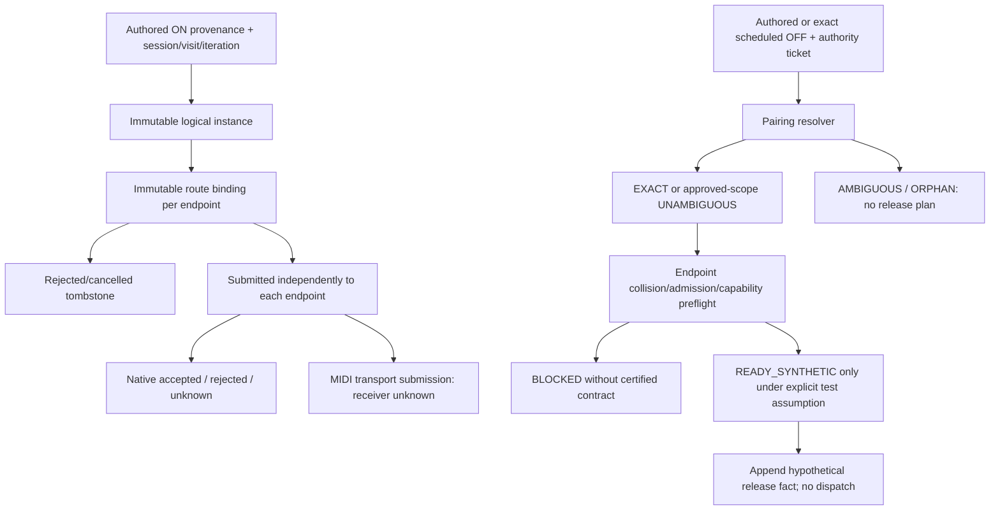

# F03 test-only architecture prototype (P0)

## Scope and decision

Baseline: `5e24102617a838dd3a1aa0acb2d774a071d48e62`, parent S8
`12304d813c16c6c4fef44b3311b936051b47b01d`. The complete architecture decision
was read before implementation. This implements its authorized **P0 only**:
pure immutable bookkeeping and fail-closed decision tests. No playback code,
workflow, existing fixture, golden capture or Stage 3 configuration is changed.

Bookkeeping feasibility is testable; Yamaha pairing and usable backend selective
release remain separate unresolved gates. `READY_SYNTHETIC` is a hypothetical
model outcome, never backend certification or an audible result. There is no
engine import, MIDI/native call, scheduler integration, dispatch callback or
production invocation. The Kotlin wrapper is under `app/src/test` only; Python
model and runners are outside production build inputs. No experimental F03 APK
is created. Existing CI may build its unchanged normal debug APK.

## Files and reproducibility

- `tests/f03_architecture_prototype.py`: pure frozen dataclasses and ledger.
- `tests/test_f03_architecture_prototype.py`: 24 positive/negative unit tests.
- `tools/test_f03_prototype.py`: tests, before/after integrity checks, JSON proof.
- `tools/test_f03_prototype_host.py`: pinned host JVM S6/S7/S8 + P0 wrapper.
- `app/src/test/java/com/yourapp/yamahaarranger/arranger/StyleMixFidelityF03PrototypeTest.kt`:
  normal unit-test discovery and stdout proof, no main-source integration.
- `tests/fixtures/f03_prototype_baseline_sha256.json`: NEW manifest of all 364
  tracked baseline files, not replacement evidence or a new golden recording.

Run `python3 tools/test_f03_prototype.py`. Its proof is written to
`build/f03-prototype/proof.json`; the model performs no I/O. After the existing
S1–S5 host suite, run `python3 tools/test_f03_prototype_host.py` to compile and
execute 13 existing/new orchestration tests with pinned dependencies. The new
wrapper also runs under unchanged Android Gradle unit-test discovery.

## Identity, facts and invariants

`InstanceId = (session epoch, style hash, section visit, loop iteration,
EventId, occurrence)`. `EventId` retains decoded index, source/key, authored tick,
optional raw ordinal/offset, and explicit provenance. `Instance` additionally
retains section/part, projected/absolute tick, policy and chord-version provenance.
DECODED_ONLY never fabricates raw offsets. Same-tick ONs can have distinct IDs.

`BindingId = (InstanceId, route revision, Endpoint, destination, pitch)`;
`Endpoint = (kind, stream/port identity, output epoch, conflict domain)`.
Rebinding preserves the logical ID, increases route revision and requires the
old route to be logically retired. Identity and every ledger snapshot are frozen;
updates return a new value with append-only facts. No old owner is overwritten.

Admission facts are endpoint-specific: CREATED -> POLICY_REJECTED or SUBMITTED
or CANCELLED_BEFORE_SUBMIT; BASSMIDI submitted may receive NATIVE_ACCEPTED,
NATIVE_REJECTED or ADMISSION_UNKNOWN. MIDI OUT submission cannot become a native
or receiver acknowledgement. Duplicate intents and invalid receipts are errors;
unknown admission never permits blind retry. Rejected instances remain pairing
tombstones so an OFF cannot silently skip to a newer admitted instance.

Collision keys are endpoint/destination/pitch, independently of source. Different
sources converging on the same output collide. Separate ports, streams, pitches,
destinations and output epochs partition the model. A PITCH_WIDE test domain
removes destination from the key, preventing invented channel isolation. Counts
are binding facts, **not native voice counts**. RELEASE_SUBMITTED retires a
hypothetical binding from the logical live set, not proof that PCM is silent;
release-tail/native lifetime remains unknown.

The prototype does not decode styles or run CASM. Frozen S5 events are inputs,
not fresh parser/transform/scheduler evidence. Raw event indices are retained
from the saved reduced windows. No trace observation becomes a Yamaha contract.

## Pairing and backend decision matrix

| Situation | Logical result | Backend/model result | Evidence/limit |
|---|---|---|---|
| Authorized exact target | EXACT | Admission/collision checks still required | Synthetic exact identity |
| One candidate, explicitly approved synthetic scope | UNAMBIGUOUS | No automatic wire release | Scope assumption, not Yamaha proof |
| Singleton without approved scope | AMBIGUOUS | No selection | Fail closed |
| Multiple source/key candidates, including rejected history | AMBIGUOUS | No FIFO/LIFO selection | All candidate IDs returned |
| Missing/unauthorized exact target, stale authority | ORPHAN | No selection | Explicit reason retained |
| Exact rejected/cancelled binding | EXACT | NO_WIRE; logical retirement only | Cannot release newer admitted note |
| Accepted BASS binding, unknown peer admission | EXACT | BLOCKED | Cannot infer actual native occupancy |
| Same output, different sources | Independent logical IDs | Shared collision accounting | Source uniqueness does not solve backend collision |
| MIDI OUT submitted | Any proven logical result | BLOCKED for release capability | No receiver acknowledgement/certification |
| Unknown native profile, even singleton | EXACT | BLOCKED | Linux observations alone are not a certified profile |
| Hypothetical selective handle | EXACT | READY_SYNTHETIC | Test assumption only; no such handle is implemented |
| Explicit synthetic order, requested target is victim | EXACT | READY_SYNTHETIC | Caller-provided order, never inferred FIFO |
| Explicit order, requested target differs from victim | EXACT | BLOCKED | No coalescing/retrigger/defer/replay workaround |
| Incomplete order/capability | EXACT | BLOCKED | No invented victim |
| Interrupted dual-output cleanup, one unsupported endpoint | Exact snapshot | BLOCKED atomically in model | No partial logical release of supported endpoint |

`apply_plan` revalidates ticket, immutable binding, current admissions and
collision set; a plan becomes invalid if another unknown collision appears.
Forged READY_SYNTHETIC, repeated intents and stale plans cannot append facts.
Neither reference counting nor retrigger is used as a substitute release policy.

## Generations and cleanup

- Session epoch separates stop/restart. Old OFFs, plans and receipts cannot touch
  the new session. SESSION_TERMINATED means logical retirement, **not silence**.
- Section visit and loop iteration increase; plan revision changes with them.
  Modulo section names/ticks are never authority keys.
- Natural carry preserves owners without blanket cleanup. Explicit carry grants
  authorize old and new tickets for the exact old ID; an old ticket cannot select
  a new same-key ON. Missing carry permission yields ORPHAN, not implicit release.
- Interrupted transitions freeze the full tracked outgoing snapshot, including
  earlier carry. An incoming ON is forbidden until the cleanup barrier clears.
  Unsupported binding preflight returns the unchanged ledger and BLOCKED.
- Synthetic selective cleanup can retire that snapshot and allow the next ON.
  Unknown/nonselective conflicts cannot pass by emitting broad OFF/all-notes-off.
- Orphan OFF is a diagnostic outcome. Rejected or logically released history is
  retained until snapshot/session retirement; the prototype deliberately does
  not guess authored lifecycle completion to remove ambiguous tombstones.

## Positive and negative tests

24 Python tests execute; their full names/results are in process/JUnit stdout.

| Group | Positive/control | Negative outcome verified |
|---|---|---|
| Identity/provenance | Immutable same-tick occurrences, decoded-only, route revision | Duplicate ID and premature route replacement rejected |
| Pairing | Exact and explicitly scoped singleton, orphan | Multiple candidates and unapproved singleton AMBIGUOUS |
| Admission | Separate native acceptance and MIDI unknown | Native acknowledgement on MIDI, duplicate/rejected/unknown retry denied |
| Output collision | Source convergence, stream/port/channel/pitch/epoch partition | Pitch-wide collision and unknown peer block release |
| Capabilities | Hypothetical selective and explicit victim order | Wrong victim/incomplete profile/uncertified S8 profile BLOCKED |
| Natural transition | Explicit carry exact old/new ticket | Old work cannot select new owner; unapproved carry ORPHAN |
| Interrupt | Full snapshot including carry and synthetic cleanup | Incoming ON barrier, reused snapshot and dual-output partial cleanup blocked |
| Stop/restart | New epoch remains independent | Old OFF/receipt/plan rejected |
| Stale plan/history | Revalidated immutable plans | New collision/forged plan/duplicate release rejected |
| Saved evidence | Case 007 preserves two IDs; all 523 saved overlap cases retain both ON IDs | Authored case 007 OFF remains AMBIGUOUS; UNKNOWN audible labels unchanged |
| Boundary | AST imports only dataclasses in model | No native/MIDI/engine/dispatcher imports or calls |

Synthetic transitions include Main D -> Fill B -> Fill A -> Main A and
Main C -> Fill D -> Main B. These verify logical barriers and grants, not Yamaha
musical timing or device PCM. The 523-case test reads only the two saved ONs per
case; it is not a new full-corpus scan or a replay of all lifecycle events.

## Comparison with architecture D1–D7 and gates

| Decision | P0 realization | Remaining condition before production |
|---|---|---|
| D1 immutable identity | Instance, route and admission fact separation | Decoder provenance propagation, thread ownership and bounded storage |
| D2 pairing | Four explicit outcomes; no default FIFO/LIFO | Real Yamaha pairing evidence and approved singleton scope |
| D3 endpoint accounting | Independent admission, conflict keys, unknown blocks | Certified physical endpoint domains and receiver lifetime |
| D4 nonselective limitation | Victim mismatch/unknown rejected | Approved fail-closed start/abort policy; no automatic workaround |
| D5 generations | Carry grants, stale guards, cleanup barrier | Actual scheduler cancellation/drain and physical cleanup evidence |
| D6 reject/orphan/history | Tombstones, no silent skip or retry | Traceable bounded retirement and overflow policy |
| D7 existing musical semantics | No production integration | CASM/NTR/NTT/RTR, chord, rhythm/ACMP and all section regression gates |

This provides only bookkeeping portions of G1–G3. It cannot pass physical G4–G7.
It models neither BASS voices nor PCM, CASM, NTR/NTT/RTR, SFF2, chord detection,
rhythm/sample voices, ACMP, MIDI hardware or concurrency. Output epoch is an
identity partition; physical stream/port closure, registry certification and
stale transport delivery are not modeled. Serial immutable snapshots do not
prove thread safety. Tuples retain history without production memory bounds.

## Regression, integrity and CI

Local results (2026-10-08):

| Check | Status | Measured scope |
|---|---|---|
| `tools/test_voice_resolver.py` | PASS | Full available host regression script, native/mock and structural guards; no Yamaha audio inference |
| SFF1 pipeline `--existing-regressions --s2 --s3 --s4 --s5` | PASS | 83 JVM tests, 20 unchanged captures and frozen S5 replay controls |
| `tools/test_sff1_harness.py` | PASS | Seven fail-closed harness tests |
| `tools/test_f03_prototype_host.py` | PASS | 13 JVM tests: unchanged S6/S7/S8 classes plus P0 wrapper |
| P0 Python suite | PASS | 24 bookkeeping tests, including all 523 saved overlap identity checks |
| S7 native API recorder / real Linux SDK | PASS / PASS | Existing probes rerun; device audio UNRUN, handles UNKNOWN |
| S8 real Linux SDK | PASS | Existing signatures + S7 release-tail control rerun; long-release classification remains UNKNOWN |
| Entire baseline manifest | PASS | All 364 tracked files byte-identical before/after, including workflow, production, old fixtures and golden files |
| Full original 503 corpus | BLOCKED | Original ZIP/hash unavailable; not rerun |
| Android / PSR-E343 physical audio | UNRUN | No device evidence |
| New production behavior | NOT CONNECTED | P0 has no dispatch path |

No executed test failed. Known baseline failure captures are preserved and their
regression guards passed; this does not declare F03 or other baseline musical
issues fixed. Native SDK PASS means the unchanged native diagnostic executed,
not that P0 supplied a voice handle or proved Yamaha pairing. The manifest checks
all baseline bytes, not just a selected source subset. The P0 runner checks it
before and after tests; CI repeats that through the new test-only wrapper.

CI: **Build #805 SUCCESS**, tested commit
`311a54054111bda00a9535e05a9faaaff14a418b`.
[Run 37771555686](https://github.com/pulicarpus/YamahaArranger/actions/runs/37771555686),
job `113292126677`: 41 steps SUCCESS, one existing conditional step SKIPPED
(`Verify bank-contract APK runtime byte-identical to build 783`); that skipped
check is not promoted to PASS. The build step runs `testDebugUnitTest`, asserts
zero failures/errors/skipped JVM tests, then builds the unchanged standard APK.
Both native ABI Stage 3 exclusion checks and diagnostic artifact uploads passed.
No experimental F03 APK or production integration was added.

Public metadata confirms `mix-percussion-proof` artifact `11547449247`, digest
`sha256:b1ce845d115684711630479e1ea29b7e4f25d177584e0068d5171c8d9735ebe3`.
The unchanged upload pattern includes `TEST-*StyleMixFidelity*.xml` and therefore
the P0 wrapper/proof. Artifact payload and exact aggregate CI test count were not
downloaded/independently inspected; local counts above are directly measured.
The standard `app-debug` artifact is `11547359403`, digest
`sha256:0d9e5af05d7d5b6761c75bba4e25d88176a7d480e81a9739748ef7c6228e2a1d`.

This CI evidence is recorded by a follow-up **documentation-only** commit.
Its executable/test/manifest files are identical to the tested commit; the
workflow ignores docs-only pushes. Local and final baseline SHA checks remain
PASS for all 364 original tracked files. Working tree and remote HEAD are
verified after pushing the evidence update.

## BLOCKED / UNKNOWN / UNRUN and production risks

- **BLOCKED:** Yamaha authored overlapping-note pairing; no FIFO/LIFO contract.
- **BLOCKED:** actual selective-release capability and MIDI receiver fallback.
- **BLOCKED:** fresh original 503-style conformance run: original `sff1.zip` and
  matching corpus hash are unavailable. Existing fixture/hash checks are separate.
- **UNKNOWN:** P0 native voice identity/PCM; this model supplies no new evidence.
  Existing S8 Linux evidence retains its original scope and limitations.
- **UNRUN:** Android physical native/PCM and PSR-E343 receiver behavior.
- **UNKNOWN:** physical stop/cleanup/release-tail completion and transport epochs,
  real concurrency, resource limits and safe runtime abort policy.

An incorrect production carry grant could cut the next section; rejected-history
removal could shift pairing; unknown MIDI delivery could produce hanging/cut
notes. Logical counts cannot determine voice multiplicity. Synthesizer-specific
victim order may change with Android SDK/build, sustain, velocity, voice stealing
or retrigger. New routing/channel splitting, count-based suppression and broad
OFF must not be introduced from these synthetic results.

Keep P0 isolated. Next safest work is external evidence/certification (architecture
P1), not playback implementation. P2 shadow accounting, production identity
plumbing, opt-in behavior and any fallback require separate explicit approval.
Rollback of P0 is a focused revert of these new files, restoring baseline
`5e241026...`; production rollback anchor remains final S8 `12304d813...` with
unchanged source tested by Build #804. No live queue migration is authorized.

**STOP:** no production F03 implementation, no experimental F03 APK, no automatic
next stage. Passing synthetic bookkeeping is not Yamaha audio acceptance.
