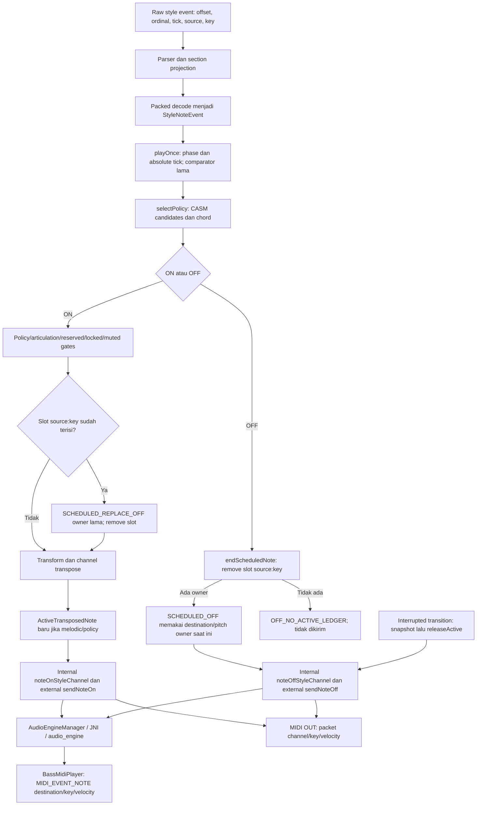

# S6 — F03 root-cause investigation

## Ruang lingkup dan identitas

Diagnostic-only. Tidak ada implementasi perbaikan F03, perubahan playback,
CASM, scheduler, BASSMIDI, SF2, mixer, MIDI routing atau aktivasi Stage 3.
Investigasi S1–S5 tidak diulang; fixture S5 dipakai sebagai bukti tersimpan,
dan suite lama dijalankan sebagai pemeriksaan regresi.

Repository `pulicarpus/YamahaArranger`, branch
`fix/mix-percussion-fidelity-784`. HEAD lokal dan remote sebelum S6 sama:
`b151919bd9192098d9b8cfd8c3f2cc0d5772b02f`.
Parent S5 `98a9d2a79b6226bf14b0a4be624f494a878b2ac5`;
tree S5 `cbe602632266cc36ba10cb7e17412454fd6e5d0e`.
[Build S5 #799](https://github.com/pulicarpus/YamahaArranger/actions/runs/37717261659)
SUCCESS untuk commit tersebut.

Semua 25 berkas dalam diff commit S5 tetap byte-identical, termasuk seluruh
fixture F03, tes S5 dan dua entry point host. Preservation guard 191 berkas
dan identitas produksi portable juga lulus. Bukti hash dan distribusi ada di
[`s6_f03_evidence.json`](../tests/fixtures/s6_f03_evidence.json).
Commit S6 adalah commit yang menambahkan dokumen ini; identitas lengkap dapat
dibaca dengan `git log -1 --format='%H %P %T' -- docs/S6_F03_ROOT_CAUSE.md`.
Tidak ada hash commit yang mengacu pada dirinya sendiri di dalam dokumen.

**Kesimpulan:** replacement owner dan NOTE_OFF yang mengakhiri owner terbaru
terbukti di registry/dispatch. Pemendekan interval dispatch terbukti terhadap
model FIFO observer. NOTE_OFF lama yang diinjeksi dapat melepas owner section
berikutnya, bahkan dengan destination berbeda. Race spontan, kehilangan suara
Main/Fill di perangkat, dan identitas voice native yang benar-benar dilepas
tetap UNKNOWN. S6 tidak mengubah status F01 UNRESOLVED atau ledger F01–F15.

## Lifecycle NOTE_ON/NOTE_OFF



Raw ordinal/offset memungkinkan dua ON dibedakan di bukti, tetapi bukan token
ON-instance pada objek playback. `ActiveTransposedNote` menyimpan section,
part, sourceTick dan diagnostic onId; key registry tetap `sourceChannel:key`.
Tidak ada section/session generation dalam key atau filter scheduled OFF.
Istilah `g0`, `g1`, dan `E0` di tes S6 adalah label fixture observer saja.
Tidak ada perubahan data produksi atau generation yang disuntikkan ke owner.

Peta boundary yang tetap:

| Boundary | File/fungsi | Makna bukti |
| --- | --- | --- |
| Decode | `StyleRepository.kt:184`, `decodePackedEvents` | Decode lama digunakan oleh tes S5, bukan salinan parser |
| Scheduling | `StyleSequencer.kt:813`, `playOnce` | Absolute tick berasal dari start + event relative; ON-first same tick tetap |
| Admission | `StyleSequencer.kt:969–989`, blok synchronized dalam `playOnce` | Slot collision, release lama, transform, owner baru |
| OFF lookup | `StyleSequencer.kt:549`, `endScheduledNote` | Hanya source/key; incoming CASM destination/section tidak dipakai untuk memilih owner |
| Transition cleanup | `StyleSequencer.kt:326–356`, `startPlayback` coroutine | Interrupted transition melepas snapshot; natural boundary membawa owner |
| Explicit owner release | `StyleSequencer.kt:537`, `releaseActive` | Guard object identity melindungi replacement dari stale owner object |
| Internal dispatch | `StyleSequencer.kt:525`, `chordOff`; `AudioEngineManager.kt:234` | Metadata origin diteruskan saat diagnostic armed; bukan native voice handle |
| Native | `native_lib.cpp:209`; `BassMidiPlayer::noteOff` di `bassmidi_player.cpp:1192` | Melodic request menjadi `MIDI_EVENT_NOTE` dengan key dan velocity 0 |
| External | `MidiInputManager.kt:190`, `sendNoteOff` | Packet tidak membawa source/section/generation/instance |

## Analisis seluruh 523 overlap: memakai bukti S5 yang dibekukan

523 raw overlap pada 47 style; maximum multiplicity 2. Ada 1046 reduced-window
transcript pada C major dan F major. Semua digest fixture TSV, CSV, inventory,
trace, joined summary, source guard dan ledger S5 diverifikasi tanpa re-record.
Reduction menghilangkan sumber lain: bukan full-style replay atau bukti PCM.

| Kategori C major | Jumlah | Interpretasi |
| --- | ---: | --- |
| Raw source/key overlap | 523 | Dua ON berbeda ordinal; maksud musikal Yamaha belum menjadi oracle |
| Owner replacement | 276 | Collision mencapai registry, OFF lama dikirim sebelum authored OFF |
| Tanpa replacement | 247 | Jangan dihitung sebagai F03 replacement |
| Policy rejection | 56 | Subset jalur tanpa admission; bukan ownership-only audio loss |
| Orphan OFF pada sequencer | 518 | Termasuk drop/rhythm/no-owner; bukan 518 bug atau stuck voice |
| Strict distinct-tick FIFO duration witness | 31 | Dua interval dispatch terpotong relatif model observer; bukan audio certification |

Distribusi raw/replacement/strict FIFO, dihitung dari semua kasus C major:

| Section | Raw | Replacement | Strict FIFO |
| --- | ---: | ---: | ---: |
| MainA | 26 | 18 | 2 |
| MainB | 48 | 22 | 5 |
| MainC | 19 | 11 | 4 |
| MainD | 79 | 50 | 4 |
| FillAA | 14 | 8 | 1 |
| FillBB | 18 | 13 | 3 |
| FillCC | 21 | 9 | 2 |
| FillDD | 35 | 23 | 2 |
| FillBA | 20 | 5 | 0 |
| IntroA | 6 | 0 | 0 |
| IntroB | 79 | 41 | 4 |
| IntroC | 55 | 21 | 0 |
| EndingB | 46 | 32 | 4 |
| EndingC | 57 | 23 | 0 |

10 cross-section raw windows berasal dari `Latin/Montuno1.T109.sst`. Raw
section overlap tidak membuktikan pengguna memainkan chain Main/Fill tertentu.
Tidak ada promosi 523 raw overlap menjadi 523 kegagalan suara.

## Counterexample nyata: event identity dan timestamp musikal

Case S5 `007`, `Ballad/J-Ballad2.S261.prs`, SHA256
`2938cdd500b628eabe88f44ce670f1af9ee7dee54b23599d8ded045b31f3a2c9`.
Section `EndingB`, source11/key67, destination11/pitch67 pada C major.
Semua waktu di bawah adalah **SMF ticks PPQ1920**, bukan wall clock perangkat.
Section start raw tick199680. Tidak ada pengukuran latensi atau PCM di fixture.

| ID observer | Raw ordinal / offset | Raw tick | Section tick | Input | Expected FIFO observer | Actual produksi |
| --- | --- | ---: | ---: | --- | --- | --- |
| E0 | 3739 / 15592 | 202560 | 2880 | ON67 v76 | Admit instance E0 | ON dst11/p67; owner E0 |
| E1 | 3759 / 15685 | 204480 | 4800 | ON67 v74 | Admit E1; E0 masih hidup | OFF E0 lalu ON E1; owner diganti |
| E2 | 3761 / 15693 | 204600 | 4920 | OFF67 | Akhiri E0; E1 tetap hidup | Akhiri owner E1 (originTick4800) |
| E3 | 3832 / 15990 | 208780 | 9100 | OFF67 | Akhiri E1 | `OFF_NO_ACTIVE_LEDGER`; tidak dikirim |

Interval FIFO E0 `[2880,4920)` dan E1 `[4800,9100)` dibanding actual dispatch
E0 `[2880,4800)` dan E1 `[4800,4920)`: kekurangan 120 dan 4180 ticks.
Jika dihitung pada tempo referensi 120 BPM, 1 tick = 0.2604167 ms: 31.25 ms
dan 1088.5417 ms. Itu konversi analitis, **bukan tempo rekaman atau durasi suara
yang terukur**. Raw event tidak memiliki per-instance OFF token: atribusi FIFO
adalah kontrak observer, bukan bukti Yamaha memilih pasangan tersebut.

## Reproduksi Main/Fill S6 dan expected versus actual

[`S6F03RootCauseTest.kt`](../app/src/test/java/com/yourapp/yamahaarranger/arranger/S6F03RootCauseTest.kt)
menjalankan `StyleSequencer` asli dengan mock pada boundary audio/MIDI saja.
Tidak ada copied scheduler, selector, transform atau registry. Clock origin0
untuk `playOnce`, PPQ tinggi untuk coroutine: deterministik tick/urutan, bukan
simulasi performa perangkat. Semua fixture transisi di sini sintetis, bukan
transplantasi section corpus yang diklaim sebagai sesi perangkat.

| Reproduksi | Kontrak expected / negative control | Actual yang diasert |
| --- | --- | --- |
| Natural chain + explicit old-OFF injection: MainD→FillBB→FillAA→MainA | E0 g0/MainD/t0/d11/p60; E1 g1/FillBB/t4/d12/p60; OFF E0 di t5 seharusnya tidak memilih E1 dalam kontrak sintetis | ON E1 mengirim OFF d11; injected MainD OFF dipilih dengan source4/key60 dan mengirim OFF **d12**; registry kosong. FillAA d13 dan MainA d14 tetap ON/OFF normal |
| Natural carry control | Fixture sengaja mengizinkan E0 MainD hidup melewati FillBB dan diakhiri OFF FillAA/t8 | Owner object sama sampai OFF; OFF dst11/p60 benar terhadap kontrak carry. Cross-section OFF tidak otomatis bug |
| Interrupted MainD→FillBB→FillAA→MainA | Transition boundary absolut t1; cleanup outgoing memang diharapkan. Tiap incoming section punya ON rel0, ON rel1, OFF rel2, OFF rel3 pada source/key sama | Outgoing OFF dst11 satu kali tanpa ALL_OFF. ON ticks `[0,1,2,5,6,9,10]`. Tiap section: ON, replacement OFF, ON, first scheduled OFF, final orphan; audio/MIDI sama; final owner kosong |
| Interrupted MainC→FillDD→MainB | Variasi independen, kontrak yang sama | ON ticks `[0,1,2,5,6]`; cleanup benar, overlap internal tetap collision, final owner kosong |

Pada interrupted chain, generation observer g1 FillBB: E1 ON/t1, E2 ON/t2,
E3 OFF/t3, E4 OFF/t4; g2 FillAA analog t5–8; g3 MainA t9–12.
Under FIFO, expected ON/ON/OFF/OFF. Actual ON/OFF(replacement)/ON/OFF;
orphan terakhir tidak dikirim. Destination g1/g2/g3 = 12/13/14, pitch60.
Ini membedakan kehilangan instance **di dalam section** dari cleanup transition
yang disengaja. Test memasang `PendingTransition` tepat dari callback dispatch,
jadi GUI tombol, fase manusia dan race spontaneous tidak dibuktikan.

Injected old OFF di t5 memakai input section `MainD`, CASM destination11 dan
source/key sama, sementara live owner berasal dari FillBB/d12. OFF request d12
membuktikan lookup registry mengabaikan incoming section/destination. Namun
fixture memanggil scheduler dengan old-section input secara eksplisit. Tidak
boleh disimpulkan production coroutine otomatis menghasilkan event lama itu.

## First divergence dan isolasi root cause

**First divergence owner admission:** `StyleSequencer.kt`, `playOnce`, line970
lookup `activeTransposedNotes[key]` dengan key line969 `sourceChannel:key`.
Saat `previousActive != null`, line973 `chordOff(...SCHEDULED_REPLACE_OFF)`
dan line974 MIDI OFF melepas E0, lalu line975 menghapus slot. Pada real case007
triggernya E1 ordinal3759, offset15685, raw tick204480/relative4800. Ini terjadi
**sebelum** transform E1 line980 dan sebelum assignment baru line989.
Karena itu mengubah SF2/gain/voice preset tidak memperbaiki kehilangan identity.

**Second divergence OFF attribution:** `endScheduledNote`, line550
`remove("$sourceChannel:$sourceNote")`; tidak ada ON-instance, incoming section,
generation atau authored ordinal. E2 ordinal3761 melepaskan E1/sourceTick4800.
Pada explicit old-section S6 injection, kondisi yang sama memilih FillBB/d12,
bukan MainD/d11. Object guard `releaseActive` line539 bukan guard untuk jalur
scheduled OFF, sehingga keberhasilannya menolak stale owner object tidak
menutup celah scheduled-event identity.

| Lapisan alternatif | Yang sudah dipisahkan | Batas |
| --- | --- | --- |
| CASM | Case007 kedua ON admitted pada dst11/p67; S6 control melodic policy tetap, output sama | 56 policy rejection tetap terpisah; authored intent/NTT oracle tidak dibuat |
| Scheduler | Strict witness tick berbeda; tidak bergantung tie comparator. S6 tick assertions menggunakan scheduler asli | F02 same-tick ordering tetap; race/cancellation real clock UNKNOWN |
| Voice mapping / SF2 | Replacement OFF terjadi sebelum backend; S6 dst berbeda membedakan logical owner | Backend bisa reject ON; logical owner tidak menjamin voice terdengar |
| MIDI OUT | Urutan channel/pitch audio dan MIDI sama pada tes; serializer S5 tetap lulus | Receiver dapat oldest/newest/all-match; packet tidak punya instance token |
| BASSMIDI | Native S5 8 checks memakai player produksi dan API recorder, flag NOTEOFF1 dipertahankan; melodic OFF mengirim dst/key | Recorder bukan real voice/PCM oracle. Source-origin tidak menjadi selective voice handle |
| Rhythm/fallback | One-shot/rhythm tanpa melodic owner tidak dihitung sebagai F03 replacement otomatis | Percussion owner queues dan sample fallback pitch-wide release adalah scope terpisah |

## Klasifikasi

| Klaim | Status | Bukti/limit |
| --- | --- | --- |
| Dua raw ON kehilangan representasi simultan pada satu source/key | PROVEN | 276 reduced replays, registry satu slot |
| ON kedua memicu early OFF lama dan owner replacement | PROVEN | Distinct-tick case007 dan current-code transcripts |
| First authored OFF memilih owner terbaru | PROVEN di registry; FIFO attribution eksplisit | originTick4800 pada OFF pertama case007 |
| Note interval dispatch terpotong | PROVEN relatif FIFO observer | 31 strict witnesses; tidak disamakan dengan durasi synth |
| Old-section OFF melepas next-section owner | PROVEN **under explicit injection** | S6 destination11→12 control |
| Spontaneous stale coroutine OFF saat Main/Fill | SUSPECTED | Generation discriminator absent; injected ability bukan kejadian lapangan |
| Audible Main/Fill loss disebabkan F03 | UNKNOWN | Tidak ada paired device input/native acceptance/PCM capture |
| Native voice instance yang salah dimatikan | UNKNOWN | Destination/key API tidak menunjukkan instance voice |
| Interrupted cleanup sendiri adalah bug | Tidak terbukti | Negative control: outgoing release disengaja, no ALL_OFF |
| Seluruh 523 overlap gagal audio | Tidak didukung | Raw overlap/policy/one-shot/backend scopes berbeda |

## Rancangan perbaikan terkecil — proposal saja

Ganti nilai satu-slot melodic source/key dengan bounded collection immutable
ON-instance records. Simpan original event identity/provenance, section/session
generation, admission status, current destination/pitch dan policy. ON baru
tidak membuat OFF semata-mata karena source/key sama. Retarget dan cleanup
beroperasi pada exact instance; stop dan transition melihat seluruh instances.

Scheduled OFF harus memiliki kontrak pairing yang **disetujui terpisah**.
FIFO adalah kandidat observer, bukan Yamaha certification. Rejected ON perlu
accounting agar OFF-nya tidak memakan admitted instance lain. Generation guard
menolak stale scheduled work tanpa membuang intentional cross-section carry.
Jangan sekadar mengabaikan semua OFF lintas-section: negative control S6
menunjukkan bahwa itu dapat mematahkan termination yang sengaja diizinkan.

Per-source FIFO saja tidak cukup untuk dua source yang bertemu di destination/
pitch sama. BASS NOTEOFF1 request dan MIDI OUT tetap tidak punya instance handle.
Perlu bukti receiver/backend atau scope restriction sebelum implementation.
Reference counting, coalescing, channel allocation dan retrigger dapat mengubah
sound/routing dan **tidak** disetujui oleh tahap ini.

Risiko: retention tak terbatas, pairing OFF rejected ON, retarget multiplicity,
cross-source output collision, natural carry vs interrupted cleanup, cancellation
generation, one-shot rhythm release dan fallback. Minimal rollback kembali ke
S5 sambil mempertahankan diagnosis dan semua frozen non-F03 expectations.

## Tes wajib sebelum implementasi

1. Explicit approval pairing/scope dan daftar F03-only delta; jangan auto-record
   golden lama atau menghapus guards untuk membuat perubahan lulus.
2. Same source/key multiplicity, 31 real distinct-tick witnesses, rejected ON,
   final cleanup dan ordinal/instance/generation attribution.
3. S6 interrupted chains dan natural carry control; GUI/phase path asli serta
   captured MainD→FillBB→FillAA→MainA session jika mengklaim device loss.
4. Deterministic cancellation/stop/restart stale scheduled work, stale-owner
   object control, chord retarget/RTR/no-chord, ACMP dan section remapping.
5. Shared destination/pitch dua sumber dengan real BASS voice/PCM evidence;
   receiver MIDI OUT nyata atau batas device-specific yang dinyatakan.
6. Rhythm/one-shot/percussion, fallback, failed native admission, no extra ON,
   no ALL_OFF leakage dan keyboard ownership isolation.
7. SFF1 strict corpus 503/503, semua 20 golden captures dan F01–F15 ledger,
   S2/S3/S4 guards, S5 191-file preservation, seluruh host regression dan Android
   unit tests, arm64-v8a/armeabi-v7a, Stage3 exclusion, artifact workflow.

## Validasi S6 dan keterbatasan

Commands yang dijalankan pada current cloud instance:

```sh
python3 tools/test_voice_resolver.py
python3 tools/test_sff1_pipeline.py --fetch-dependencies --existing-regressions --s2 --s3 --s4 --s5
python3 tools/test_s6_f03.py
python3 tools/test_sff1_harness.py
```

Host compiler memakai JDK21 dengan target JVM17; dependencies Maven SHA-pinned
diverifikasi oleh runner. Tidak ada verification bypass. Hasil:

| Pemeriksaan | Hasil |
| --- | --- |
| Full repository host resolver/native/diagnostic/percussion/source regression runner | PASS; native S5 API recorder 8 checks termasuk |
| JVM S1–S5 + existing regression | 83 tests PASS; 20 digest golden byte-identical; 1046 S5 traces tetap pinned |
| Tambahan JVM S6 | 4 tests PASS; real coroutine, owner snapshots, exact audio/MIDI sequences dan absolute ON ticks |
| SFF1 fail-closed harness | 7 tests PASS |
| F03 evidence guards | 7 tests PASS; 191 preservation files dan semua 25 S5 diff files identik |
| Production/build/workflow tracked diff terhadap S5 | EMPTY |
| Full corpus conformance 503/503 di sesi S6 | **BLOCKED: corpus asli tidak tersedia**; ZIP metadata drum yang ada bukan corpus tersebut |
| Corpus-dependent S2 native boundary, S3 full503 semantic matrix dan S4 full503 root audit | **BLOCKED** untuk rerun lengkap; source guards, synthetic native checks dan frozen evidence tests tetap PASS |
| Real native melodic voice / PCM / device Main-Fill | UNRUN; tetap UNKNOWN |

Corpus 503/503 adalah hasil baseline tersimpan, bukan hasil scan baru sesi S6.
S6 diselesaikan menggunakan fixture S5 yang tersedia; corpus-dependent tests
tetap BLOCKED, terpisah dari tes terverifikasi. Semua fixture dan expected
manifest tetap tidak berubah. Perintah setelah corpus tersedia:
`python3 tools/audit_sff1_corpus.py --corpus /path/to/sff1.zip` (atau exact
extracted directory). Hash ZIP wajib
`a9b89b90e1dee25c714a076a125d6c7173bcca0e8d2029c57092b3295035d465`.
Jangan mengeklaim scan baru 503/503 atau gate implementasi lengkap sebelum check
wajib ini dijalankan.

Android `testDebugUnitTest` otomatis memasukkan class S6 baru tanpa perubahan
workflow. Runner host baru tidak mengedit entry point S5. Nomor build/result
commit S6 dilaporkan sesudah push, di laporan akhir; CI success tidak disimpulkan
dari Build799. Berkas laporan akhir lokal asli S5 tetap tidak tersedia; S6
mendasarkan kesimpulan pada commit/fixture/Actions evidence yang terverifikasi.

**STOP. Tidak ada S7 atau implementation F03 tanpa persetujuan berikutnya.**
