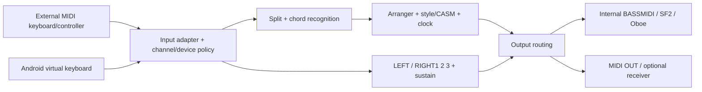

# YamahaArranger — Production Recovery Roadmap

Tanggal: 2026-10-08. Branch: `fix/mix-percussion-fidelity-784`.
Baseline keputusan: `9c04460be8d0159e74c21fde20e3c1a2b1d334cf`, HEAD lokal dan remote cocok, working tree bersih sebelum penulisan. Dokumen ini mengonsolidasikan bukti tersimpan dan menelusuri perubahan terkait; tidak menjalankan ulang audit S1–S8/P0/P1 atau mengubah playback.

## Keputusan yang dapat dieksekusi

**Rekomendasi pertama: patch F04 yang dibatasi pada policy miss untuk source dengan deklarasi CASM melodic yang jelas.** Tujuannya menghilangkan NOTE_ON percussion yang berasal dari lane melodic yang ditolak, bukan membuat seluruh part selalu berbunyi. Ini tidak memerlukan keputusan FIFO/LIFO, perubahan transformer, atau penggantian engine.

Ada tiga kandidat: F04 gate routing, F02 preservasi urutan event pada tick sama, dan F12 terminal duration. Hanya F04 direkomendasikan untuk tahap implementasi pertama setelah persetujuan pengguna dan penetapan gate regresi di bawah. F02/F12 adalah kandidat bersyarat, bukan izin membundel perubahan. **F03 tetap NO-GO.** Clipping dan realtime belum memiliki lokalisasi penyebab yang cukup untuk patch suara baru. Tidak ada revert/cherry-pick, Stage 3, P2 F03, APK eksperimen atau implementasi otomatis.

## 1. Hierarki bukti dan kronologi baseline

CI hijau membuktikan pemeriksaan yang dijalankan, bukan kesetiaan musikal atau kualitas audio Android. Gunakan empat lapisan terpisah: input/style bytes → actual dispatch → native admission/PCM → rekaman dan penilaian pengguna. Synthetic PCM bukan Yamaha oracle.

| Titik | Bukti terverifikasi dalam repository | Makna untuk baseline sekarang |
|---|---|---|
| Audit awal `52e5b7e`, 29 September | [Audit](ARRANGER_ENGINE_AUDIT.md), [blueprint](ARRANGER_ENGINE_BLUEPRINT.md) | Hipotesis/prioritas historis. Klaim directional Fill hilang dan fallback Piano tidak boleh diperlakukan sebagai keadaan HEAD |
| #754–#767 | [Family gate](FAMILY_PRESERVING_RESOLVER_CHECKPOINT_20260930.md), [CC11/warm](BUILD758_WARM_SOLO_CHECKPOINT_20261001.md), [stale retarget](STALE_RETARGET_OWNER_FIX_CHECKPOINT_20261001.md), `PROJECT_NOTES.md` | Family rejection, CC11 tidak menimpa CC7, dan referential owner guard sudah ada. Catatan proyek berakhir pada #767; bukan master status terbaru |
| #776 `2f71950f6343bbfb723994ae6a2373130606a857` | [Recovery](REGRESSION_780_RECOVERY.md): baseline produksi yang dilaporkan bekerja; shadow/offline diagnostics | Pembanding suara historis yang harus dipertahankan; tidak ada rekaman referensi lengkap lintas style/perangkat di dokumen ini |
| #777 `7c919e9` → #780 `31356a45a87596de1b102e7b3af9704b65e08d36` | Private stream/render mixing, unconditional clearing, owner interception dan boundary flush masuk runtime; pengguna melaporkan style kosong/ACMP tidak bekerja | OFF flag bukan isolasi penuh. Source comparison membuktikan perubahan, bukan device bisect instruksi penyebab |
| #781 `6bc5f3aa006f908f4cc98d39ba6d7449ee3c9a84` | Sepuluh file integrasi dipulihkan byte-for-byte ke #776; Stage 3 dikarantina; laporan perangkat menyatakan Ch8/9/11 audible dan ACMP bekerja | Recovery jalur utama nyata, tetapi belum seluruh accompaniment audible |
| #782–#784 | `cb4d92b`, [presence](ACCOMPANIMENT_PRESENCE_781.md), [bank](BANK_READBACK_783.md), baseline #784 `7274e05` | Font-map failure isolation dan classification diperbaiki; perangkat #784 melaporkan seluruh accompaniment hadir/ACMP bekerja, balance/percussion buruk. Trigger map failure perangkat belum tertangkap |
| #785 `130cc20` / #786 `ee83320` | [Mix/percussion](MIX_PERCUSSION_FIDELITY_784.md), [after #785](AFTER_785_MIX_SEMANTIC_CORRECTION.md) | Authored CC/relative trim, controller cache, compatible percussion terbatas. #785: 845 compatible ON, 309 legacy, tidak ada failure/overflow; bukan bukti timbre exact |
| #787–#790 | [Role PCM](ROLE_PCM_BALANCE_786.md), [lock/session](DIAGNOSTIC_ANR_SESSION_788.md), [callback path](PCM_PATH_DEVICE_788.md) | Export lock isolation sudah diperbaiki. Zero media-volume report tidak membuktikan synth silence. Laporan #790 membuktikan PCM semua part dan imbalance; bukan hilangnya routing |
| #791 `3c156ee` | [Measured balance](MEASURED_BALANCE_791.md) | Trim fingerprint -6/-6/+12 dB adalah pilihan empiris terbatas, bukan kalibrasi Yamaha universal |
| #792 `05cdb1f0998d082d701bc0d1979580270ae2eefc` | [Headroom](PCM_HEADROOM_792.md): #791 peak mix 17.0664, existing hard clamp; asal peak belum diketahui | Observer pre/post/parent/lane ditambahkan. Clipping nyata pada report; tidak cukup untuk menuduh SF2, DSP, FX atau menetapkan limiter |
| S1–S4 | Frozen pipeline, S2 dialect metadata, S3 raw CASM provenance, S4 root evidence | Preservasi informasi meningkat; eksekusi musikal lama dipertahankan. F01 semantics UNRESOLVED, SFF2 tidak certified |
| S5–S8 / P0 / P1 / reference verification | S5 `b151919`, S6 `0faa84f`, S7 `291153a`, S8 `12304d8`; P0 `d00548c`, P1 `c92e7d3`, reference HEAD | Investigasi/test-only/dokumentasi; bukan patch F03. #803 gagal harness S8, #804 sukses setelah koreksi fixture diagnostik; tidak mengubah suara produksi |
| CI terakhir yang tercatat | [#807](https://github.com/pulicarpus/YamahaArranger/actions/runs/37780609074), source `ba97641759c8e6d4f4b16103fb4bf1c9b56e8b67`, SUCCESS; final P1 dan reference docs menyusul | Build diagnostik/regresi berhasil. Android runtime voice identity dan Yamaha device oracle tetap UNKNOWN |

Pemeriksaan source terarah: `StyleSequencer.kt`, `bassmidi_player.cpp`, `audio_engine.cpp` pada HEAD byte-identical terhadap #792. `git diff 2f71950 HEAD -- app/src/main app/build.gradle.kts` mencakup 27 file, 3016 penambahan/92 penghapusan: recovery diikuti presence, mix/percussion, trim/meters, lock/session, serta metadata S2/S3. Angka diff bukan ukuran perubahan suara; metadata/observer harus dibedakan dari perubahan mix/percussion. Jangan memulihkan seluruh tree #776 karena akan membuang perbaikan sesudahnya.

## 2. Matriks subsistem: gejala, mekanisme dan tindakan

Gejala tanpa laporan spesifik diberi label demikian. “Implemented” bukan “Yamaha-certified”. Tes tersimpan tidak otomatis berarti telah dijalankan ulang untuk dokumen ini.

| Subsistem | Gejala dan bukti penyebab | HEAD / dependensi / risiko | Tes tersedia → tambahan minimum | Kandidat produksi |
|---|---|---|---|---|
| SFF1/SFF2 parser/CASM | F01 raw root field dahulu hilang; F08 dialect tidak eksplisit; F14 descriptor tanpa source lane. Tidak ada bukti semua ini menyebabkan Love Song kosong | S2 identity + S3 raw registry/provenance sudah tersedia; selector lama belum memakai raw root semantics. SFF2 positive detection/correctness belum verified. Bergantung reference root/chord; risiko mengaktifkan lane salah | S1 captures, SffDialectBoundaryTest, SffCasmSemanticPreservationTest, SffRootSelectionEvidenceTest → root-labelled Yamaha fixtures, SFF2 asli, corpus hash | NO-GO root selector; jangan synthesize absent parts |
| NTR/NTT/RTR/chord recognition | F07 NTT6/9 fallback base dan sourceChordType tidak dikonsumsi; F15 chord-bit semantics belum certified. G→C stale retarget pernah terbukti dan sudah diperbaiki #765 | Transformer/RTR baseline tetap; lifecycle lock/referential guard harus dipertahankan. Chord capture memperlihatkan RTR OFF/ON; onset accent belum independent Yamaha defect. F03 collision berinteraksi dengan RTR | CasmNoteTransformerTest, AcmpChordAnalyzerTest, StyleChordDiagnosticRegressionTest → reference pitch/held-note tiap root/chord/NTT, input settle/sustain controls | NO-GO guessed tables/retrigger suppression |
| Main/Fill/Intro/Ending/clock | F02 ON-first reorder PROVEN; F12 terminal +1 tick PROVEN. Gap/dropout historis tercatat, causality Android terhadap F12 belum diukur | Directional enums termasuk BA sudah ada; audit awal “BA hilang” superseded. Pending/successor/master clock dipertahankan. F13 wall-time wait ke current tick belum exact boundary proof | S1 ordering captures, S6 natural/interrupted transition controls → same-tick author order, terminal OFF/EOT, controlled-clock Intro→Main/Ending→Stop/rapid Fill | F02/F12 bersyarat; jangan rewrite scheduler |
| ACMP/LEFT/RIGHT1/2/3 | #780 ACMP mati bersamaan style kosong; #781/#784 ACMP kembali. Tidak ada bukti root mask atau PSR-E343 wajib menyebabkan gejala | Brain split, ACMP/chord/keyboard domains terpisah; channels0..3 reserved. Jangan mengubah mask agar semua part terdengar. LEFT/RIGHT/sustain membutuhkan pengujian input terpisah | AcmpChordAnalyzerTest, presence/mix tests → ACMP ON/OFF, LEFT enable, RIGHT layers, held keyboard+sustain ketika transisi | Tidak ada patch baru dengan cause terisolasi |
| F03 ownership/release | 523 overlap/47 style; 276 registry replacements, 31 shortened intervals relatif observer FIFO. Replacement sebelum transform dan scheduled OFF current source:key PROVEN | Satu slot masih ada; P0 immutable ledger terisolasi saja. Native/MIDI tidak punya selector logical ID. Yamaha pairing, actual audible loss, admission bridge belum certified | S5/S6/S7/S8/P0/P1 frozen controls → keyboard case007 + Android native signatures/admission/dual-output gates | **NO-GO**, bukan patch pertama |
| BASSMIDI/SF2/resolver | Wrong-family collision dahulu, global route loss pada map failure, sudah diperbaiki. Warm Bass/Strings lemah; #790 part PCM nonzero. F09 competing setup arbitration UNKNOWN | Family gate/readback/map isolation tetap. Sample fallback pitch-wide OFF; internal synth admission ke caller masih void. Resolver tidak boleh dijadikan bypass CASM | Native production fault injection, real-BASS/multi-SF2 tests → exact device-font PCM dan failure/admission capture | Jangan tambah Piano fallback atau equal-RMS gain |
| Drum/percussion | Wrong articulation dilaporkan; F04 melodic reject→rhythm PROVEN. F05 scheduled rhythm OFF missing PROVEN, tidak otomatis audible stuck | Compatible adapter terpisah dari retired Stage 3; debug/release flag scope berbeda. One-shot/choke/owners tetap; EXACT0, key16 UNKNOWN. F04 upstream sebelum adapter | Drum/shadow/audition/percussion_real_bass tests; S1 BaroqueAir1/Unplugged2 → melodic-reject negative, valid remap positive, legacy/no-CASM controls | **F04 pertama**; F05 release perlu oracle per backend |
| Audio realtime/Oboe/mutex/latency | Cold PLAY bersamaan font reload berkorelasi stall1–14s; warm issue berbeda. Report formatting lock blockage PROVEN dan diperbaiki #788; tidak ada ANR stack semua kasus | Render masih berbagi synth mutex dengan control. Callback/decode observers tersedia; belum ada durasi wait/stack Android yang mengisolasi remaining path | Native formatter-stall, PCM-path/ON-OFF parity → correlated callback wait/start/stop/underrun pada perangkat warm/cold | NO-GO lock-free rewrite/automatic restart; gunakan observasi yang ada |
| MIDI input/controller/MIDI OUT | F06 pitch bend/CC coverage parsial; external style CC tidak setara internal. Tidak ada rekaman PSR receiver yang membuktikan pairing | chordInputChannel sudah property(default0), callbacks note-only setelah filter; split setter ada. Output ON/OFF+bank/PC, receiver acceptance UNKNOWN; F02/F03/F05/F06 terkait | S1 mocked MIDI captures → wire bytes + receiver PCM, running status/realtime/channel/disconnect controls | Belum broad MIDI-output patch; controller architecture §5 |
| Sustain/release/mixer/CC | CC11 dahulu menimpa CC7; strings floor/absolute setter dan stale applied cache terbukti, sudah diperbaiki. #791 clipping nyata, sumber peak UNKNOWN | Authored controls + relative trims/zero/mute restoration dipertahankan; fingerprint trim bukan general loudness fix. Sustain tail bukan active voice identity | StyleExpressionRegressionTest, StyleMixFidelityRegressionTest, 240 real-BASS response combos/headroom → synchronized pre/post/parent/lane worst block dari report existing | NO-GO limiter/new gain/SF2 generator rewrite tanpa lokasi penyebab |
| Meter2/4,3/4,4/4,6/8 | F13 metadata/grid2/4=3840,3/4=5760,4/4=7680 @PPQ1920 PROVEN; corpus tidak punya encoded6/8; Android seam exactness UNKNOWN | Meter bukan hardcoded4/4. FF58 byte scanner validation dan tempo-change handoff belum certified; F12 terminal convention terkait | Forro/PopWaltz captures → controlled clock empat meter, synthetic6/8 diberi label, real6/8 fixture, tempo changes | F12 subset; jangan klaim corpus membuktikan6/8 |

### Ledger F01–F15 terhadap keadaan terbaru

F01: raw loss dipreservasi S3, semantic execution tetap UNRESOLVED. F02: ON-first/global ordinal loss belum diperbaiki. F03: single-slot/ambiguous pairing NO-GO. F04: source-role exemption masih ada. F05: drum/no-policy OFF path belum lengkap dan release contract belum diputuskan. F06: event preservation tidak berarti dispatch lengkap. F07: NTT6/9/source type belum certified. F08: S2 metadata boundary selesai untuk declared SFF1, SFF2 tetap UNKNOWN. F09: destination setup arbitration bukan loss seluruh source lane; semantics UNKNOWN. F10: empty legacy SFF1 voiceMap bukan silence root cause. F11: melodic bank identity preserved, percussion translation memerlukan output-specific reference. F12: BA preserved, terminal +1 unresolved. F13: meter math tersedia, exact timing belum proved. F14: absent lane bukan missing audio; S3 registry tersedia. F15: raw mask width preserved, semantic mapping belum certified. Jangan mengedit ledger/golden historis untuk menghapus known failure.

## 3. Tiga kandidat patch dengan batas perubahan

### Kandidat 1 — F04: hentikan phantom rhythm dari rejected melodic lane

**File/fungsi:** `app/src/main/java/com/yourapp/yamahaarranger/arranger/StyleSequencer.kt`, `playOnce`, guard `policy==null … !isRhythmSource` (HEAD sekitar938), fallback `policy?.destinationChannel ?: sourceChannel`; helper `isRhythmSource` sekitar798.

**Usulan minimal:** pada NOTE_ON policy-null dengan chord aktif, periksa candidate declarations milik source part. Jika declarations tersedia dan seluruh destination jelas melodic accompaniment10..15, source8/9 tidak memperoleh pengecualian rhythm: gunakan drop diagnostik yang sudah ada. Jangan ubah selectPolicy/policyScore/mask/transform, no-chord path, declarations kosong, mixed/unknown destination, atau source rhythm sah yang mempunyai applicable policy. Scope ini tidak menyelesaikan semua F04 jika deklarasi ambigu; kasus itu tetap baseline/UNKNOWN sampai gate terpisah.

**Bukti:** saved BaroqueAir1 MainD mengirim36 src8→8 dan8 src9→9 meskipun melodic destinations; Unplugged2 menambahkan128+128 phantom ON. Current source masih memiliki exemption tersebut. Ini dispatch salah per deklarasi yang tersedia, bukan inferensi waveform/timbre. Tidak menjadikan semua rejected notes sebagai wajib dimainkan.

**Risiko/dependensi:** legacy tanpa CASM dan mixed-policy lanes tidak boleh ikut tertutup; intentional mute harus bertahan. Tidak memodifikasi owner release, jadi tidak mengklaim F03/F05 fixed. Backend internal/MIDI OUT menerima pengurangan ON salah route yang sama; native adapter tidak diubah.

**Tes minimum:** jalankan actual sequencer/repository fixtures BaroqueAir1 dan Unplugged2 untuk C/F; assert phantom44/256 menjadi0 hanya jika deklarasi memenuhi scope; valid src15→8 128 ON dansrc14→9 105 ON tetap, melodic eligible pitch/velocity/ON/OFF tidak berubah. Tambahkan source8/9 valid rhythm, empty declarations, mixed declarations, chord-null, masked/range-rejected melodic, absent roles, mute/ACMP dan Main/Fill controls. Assert old golden/ledger bytes tetap utuh.

**Gate yang harus disepakati sebelum edit:** S1 golden test saat ini sengaja mengharuskan phantom baseline. Patch memang akan bertentangan dengan frozen expectation, bukan boleh “semua baseline tests tetap PASS tanpa delta”. Pertahankan berkas capture/fixture historis; sediakan eksekusi baseline checkout dan candidate expectation terpisah dengan allowlist hanya F04. Perubahan guard/test harness untuk scope ini perlu review eksplisit; jangan melemahkan assertion atau merekam ulang golden. Jika exact differential tidak bisa diekspresikan, STOP.

**Sukses:** zero undeclared rhythm dalam scope, semua valid rhythm/melodic traces identik kecuali reviewed F04 drops, tidak ada note baru/reset/perubahan CASM. Setelah host/CI, pengguna mendengar style target dan baseline Love Song/Main/Fill pada APK produksi yang disetujui terpisah. GO sekarang adalah rekomendasi scope untuk approval, bukan sertifikasi audio atau izin publish.

### Kandidat 2 — F02: author order pada tick sama, bukan blanket OFF-first

**File/fungsi:** `StyleSequencer.playOnce` projection/comparator sekitar825–833; `StyleNoteEvent` di `app/src/main/java/com/yourapp/style/StyleModel.kt`; untuk global order, `StyleParser::parse`, JNI packed-event accessor di `native_lib.cpp` dan `StyleRepository.decodePackedEvents`.

**Bukti/usulan:** explicit input OFF→ON dan PC→ON diubah menjadi ON-first; preserve per-source authored order terlebih dahulu untuk non-overlapping cases. Jangan menentukan FIFO/LIFO untuk repeated overlapping instances. Full cross-source solution memerlukan ordinal immutable yang benar-benar berasal SMF, bukan part index yang dibuat setelah flatten. Jangan mengganti satu comparator menjadi universal OFF-first: intentional ON→OFF zero-duration harus tetap sah.

**Risiko:** setup-before-attack, zero-duration notes, shared destination state dan F03 ambiguity. Per-source stable order saja belum menyelesaikan global source order; jangan mengiklankan full fix. Scope pertama hanya boleh dipilih setelah differential membuktikan tidak mengubah ambiguous collision cases.

**Tes/sukses:** existing F02 OFF→ON/PC→ON witnesses ditambah ON→OFF, CC0→CC32→PC→ON, simultaneous distinct keys/destinations, two sources/shared destination, loop/section seam. Source parser/JNI roundtrip dan raw ordinal identity wajib untuk full variant. Success=actual order matches authored proven scope, no premature scheduled OFF pada non-overlap, non-F02 traces identik. Frozen S1 expectation memerlukan same reviewed baseline/candidate gate seperti F04. **HOLD**, tidak dibundel patch pertama; rollback satu scoped commit.

### Kandidat 3 — F12: terminal EOT duration dengan batas event eksplisit

**File/fungsi:** `app/src/main/cpp/style_parser.cpp`, `StyleParser::parse` terminal `track.events.back().tick+1` sekitar205; konsumen `StyleSequencer.playOnce` modulo/length dan natural end hanya diperiksa melalui tes, tidak langsung diubah.

**Bukti/usulan:** FillBA terminal7681/5761/3841 padahal EOT bar grid7680/5760/3840. Pertimbangkan exclusive duration tepat pada EOT **hanya** untuk verified terminal EOT dengan tidak ada musical event yang akan hilang/terlipat. Styles tanpa EOT valid atau event musikal tepat pada terminal boundary tetap baseline sampai explicit boundary policy disetujui. Tidak menganggap semua section length harus kelipatan bar atau semua Intro/Ending sama.

**Risiko:** final OFF hilang, modulo memindahkannya ke awal, loop drift/carry berubah; Android audible seam effect belum terbukti. Tidak boleh mengurangi length saja sambil diam-diam membuang event.

**Tes/sukses:** native terminal EOT-only, final OFF sebelum/saat EOT, no-EOT, next-marker boundary, repeated marker, zero/short section; saved FillBA tiga meter; controlled one-pass/master tick seam dan synthetic6/8. Success=exact exclusive interval pada subset aman, all events preserved, final OFF/carry unchanged, no clock reset; device timing confirmation kemudian. **HOLD** sampai boundary fixtures/differential lengkap; lebih kecil daripada scheduler rewrite tetapi bukan first patch.

## 4. Urutan implementasi dan rollback

1. Persetujuan scope F04 dan mekanisme candidate-versus-baseline test di atas. Pin commit HEAD roadmap sebagai rollback source; simpan konfigurasi style/fonts/mixer/device/build yang akan dibandingkan. Tidak memilih #776 sebagai target rollback otomatis.
2. Implementasi berikutnya satu commit F04+tes scoped, tanpa CASM/mix/native/workflow perubahan. Existing guards jangan diperbarui massal: stop jika produksi di luar daftar atau non-F04 trace berbeda.
3. Jalankan suites tersedia, CI dua ABI dan Stage3 exclusion. APK/device test merupakan pekerjaan berikutnya yang harus disetujui; tidak dibuat oleh pekerjaan roadmap. Lulus CI belum GO audio.
4. Device acceptance: warm steady chord Main A–D, Main D→Fill B→Fill A→Main A, Intro→Main, Ending→Stop, ACMP toggles, RIGHT/LEFT/sustain, valid percussion/choke, ≥2 menit playback. Baseline Love Song stack sama; tambah BaroqueAir1/Unplugged2. Rekam build/source, actual font hashes, control state, wire trace bila MIDI OUT, PCM/report/listening. Jangan menuntut semua delapan roles selalu hadir.
5. Rollback exact scoped commit jika valid rhythm hilang, accompaniment/ACMP regress, stuck note, unexplained PCM/controller/timing change, new clipping/dropout, mixed backend results, atau guard mismatch. Restore baseline app/settings yang dipin; reinstall/device retest. Git revert hanya dilakukan setelah instruksi implementasi/rollback berikutnya, tidak otomatis oleh dokumen ini.
6. Setelah F04 diterima, pilih F02 atau F12 secara terpisah dari gatesnya. F03 tidak masuk urutan ini sebelum independent Yamaha pairing dan target-backend admission/release memenuhi keputusan P1.

### Pemeriksaan yang sudah tersedia dan gate tambahan

[CI/P1 evidence](F03_P1_CERTIFICATION.md#integrity-regression-and-ci) mencatat host resolver/native/metadata PASS; pipeline S1/S2/S3/S4/S5 83 JVM tests; fail-closed7; P0 24; S6/S7/S8/P0/P1 wrappers14; Linux P1 probe132 windows; Android JVM/build kedua ABI dalam #807. Ini hasil tersimpan, tidak dijalankan ulang oleh roadmap. Original corpus503 fresh rerun tetap BLOCKED.

Implementasi nanti menjalankan `tools/test_voice_resolver.py`, `tools/test_sff1_pipeline.py --existing-regressions --s2 --s3 --s4 --s5`, `tools/test_sff1_harness.py`, P0/host/native diagnostic guards dan existing Android/CI suite sesuai dependencies asli. PASS/FAIL harus dilaporkan sebenarnya; frozen known-failure deltas harus ditangani melalui reviewed separate profile, tidak silent update. Jangan mempromosikan skipped/UNRUN/BLOCKED menjadi PASS. Corpus gate tidak bisa dipenuhi dengan subset fixtures; jika full503 wajib untuk release candidate, release menunggu ZIP asli.

## 5. MIDI-controller architecture yang dipertahankan

PSR-E343 adalah salah satu input/receiver opsional. Style parser, chord recognition dan arranger tetap berjalan di Android tanpa perangkat itu. Model PSR-SX/PSR reference dipakai sebagai oracle terukur bila tersedia, bukan dependency engine. Virtual keyboard harus menuju musical input logic yang sama, bukan loop melalui MIDI OUT.

| Kebutuhan | State/batas saat ini | Rencana yang dievaluasi, bukan diimplementasikan |
|---|---|---|
| Input device/channel | Android MIDI parsing/channel filter; `MidiInputManager.chordInputChannel` default0 sudah mutable | Persist explicit device/port+channel profile; support controller lain tanpa mengubah default. Pisahkan chord dan performance channel; jangan kehilangan provenance sebelum routing |
| Split | `ArrangerBrain.setSplitPoint`, default54 | Configurable split dan mode LEFT/chord/RIGHT; test notes pada batas dan held note saat setting berubah, jangan mengadopsi E343 default sebagai kewajiban |
| MIDI Learn/buttons | Tidak ditemukan certification mapping generik lengkap dalam bukti tersimpan | Optional mapping note/CC/PC ke Start/Stop/Main/Fill/Intro/Ending, debounce/press-release/pickup; reserved musical messages tidak boleh berubah jadi command tanpa mapping eksplisit |
| Sustain/velocity | CC64 channel-filtered; keyboard sustain terpisah ACMP; authored style velocities preserved | Per-input sustain domain dan explicit performance velocity curve(defaultidentity); NOTE_ON0 tetap OFF. Jangan menormalkan style velocity atau memegang chord hanya karena pedal |
| Output routing | Internal audio dan MIDI OUT adalah endpoints terpisah dengan capabilities berbeda | Internal-only/external-only/dual explicit, prevent feedback, endpoint/channel policy, disconnect/stop safety. Bytes sent bukan receiver admission; external CC/bend gap F06 butuh allowlist/output tests tersendiri |

Tambahan controller ini mengikuti acceptance F04, bukan memperluas patch pertama. Device matrix minimum nanti: virtual-only Android; generic USB MIDI keyboard; controller non-Yamaha; optional E343; input tanpa MIDI OUT, external-only dan dual output. Invariants chord state dan output independence harus diuji sebelum UX MIDI Learn/port routing ditambahkan.

## 6. UNKNOWN/BLOCKED yang menghalangi patch tertentu

| Kekosongan bukti | Menghalangi | Eksperimen/input minimum, tanpa audit ulang |
|---|---|---|
| Yamaha repeated-note pairing/natural carry/cross-source oracle | F03; bukan restricted F04 declaration gate | [Reference procedure](F03_YAMAHA_REFERENCE_VERIFICATION.md): actual case007 EndingB J-Ballad2 dan isolated repeated-note capture dengan tail controls; belum dilakukan |
| Android arm64/v7 native selective release/admission, PSR receiver | F03/native cleanup/dual-output certification | Target actual SDK/library fingerprints + native signature PCM/admission; Linux youngest-survivor observations tidak portable proof |
| Original `sff1.zip`, SHA256 `a9b89b90e1dee25c714a076a125d6c7173bcca0e8d2029c57092b3295035d465` absent | Fresh503/503 release gate; saved fixture work dapat lanjut | Supply exact archive lalu rerun frozen conformance; tidak mengarang path/results |
| Exact device SF2 PCM absent; headroom stage unknown | New gain/limiter/SF2 generator/timbre correction | Existing HEADROOM_ROLE/WORST synchronized same-decode report dahulu; actual PCM file hanya jika upstream attribution diperlukan |
| Remaining Android render-wait/underrun causal trace | Lock-free/native scheduler rewrite | Existing callback/decode/start-stop counters + target timing/stack; jangan ulang formatter-stall yang sudah terbukti/fixed |
| Raw global event ordinal belum production-carried | Full F02 across sources | Add reviewed ordered identity roundtrip and ties tests; per-part synthetic ordinal bukan original SMF proof |
| Terminal event boundary semantics / real6/8 | F12 broad fix / meter certification | Minimal EOT/OFF and controlled-clock fixtures, actual6/8 style; no mandatory scheduler rewrite |
| Frozen assertions pin current defects | Any F04/F02/F12 candidate evaluated against unchanged baseline suite | Explicit baseline/candidate test contract and narrow expected delta approval before code; never delete guard to claim PASS |

## 7. Sumber, research pembanding dan yang tidak perlu diulang

Dokumen pembanding terperinci yang benar-benar tersedia adalah [MIDI Voyager Pro5.4.11](MIDI_VOYAGER_PRO_5.4.11_AUDIO_RESEARCH.md): user APK hash, BASSMIDI, multiple fonts/priority/mapping, category fallback, loading/latency options. Pelajaran yang berlaku adalah pemisahan voice identity, soundfont mapping dan output. Rekomendasi Piano fallback di riset historis tersebut tidak mengalahkan family-preserving production gate terbaru. APK static strings bukan bukti live Yamaha overlap contract atau angka latency YamahaArranger.

vArranger, One Man Band, GigLad dan Android Arranger Keyboard disebut dalam audit/README; tidak ditemukan laporan eksperimen terperinci terpisah yang dapat dijadikan oracle pada tracked documents. Cadenza tidak ditemukan pada pencarian tracked Markdown maupun subject riwayat commit lokal. Tidak ditemukan dokumen master plan/checkpoint tunggal yang lebih baru daripada seri subsystem di atas. Riwayat yang diperiksa mencakup production-path commits #776→HEAD serta subject audit/plan/checkpoint semua refs lokal; ini bukan klaim memulihkan seluruh percakapan/aset eksternal. Roadmap ini menjadi konsolidasi terbaru, tidak mengarang studi aplikasi yang tidak tersimpan.

Sumber keputusan: [SFF1 audit/F01–F15](SFF1_REFERENCE_IMPLEMENTATION_AUDIT.md), [S1](SFF1_CORPUS_CONFORMANCE_S1.md), [S2](SFF_DIALECT_BOUNDARY_S2.md), [S3](SFF1_CASM_SEMANTIC_FIDELITY_S3.md), [S4](SFF1_ROOT_SELECTION_CERTIFICATION_S4.md), [S5](F03_NOTE_OWNERSHIP_INVESTIGATION_S5.md), [S6](S6_F03_ROOT_CAUSE.md), [S7](S7_F03_BACKEND_CONTRACT.md), [S8](S8_F03_NATIVE_VOICE_EVIDENCE.md), [F03 decision](F03_ARCHITECTURE_DECISION.md), [P0](F03_TEST_ONLY_PROTOTYPE.md), [P1](F03_P1_CERTIFICATION.md), [Yamaha reference](F03_YAMAHA_REFERENCE_VERIFICATION.md); drum/voice/checkpoint sources linked above and `PROJECT_NOTES.md`.

Tidak perlu mengulang 523-overlap inventory, 276 replacements/31 shortened witnesses, Linux S8/P1 signature experiments, P0 immutable bookkeeping proof, source recovery comparison, family collision audit, CC11 reset proof, applied-cache proof, #788 formatter lock proof, atau metadata710/1054 eligibility. Gunakan fixture dan guards yang ada. Bukti baru diarahkan hanya pada gate yang belum terpenuhi; jangan meminta seluruh rangkaian audition yang sudah tersimpan kembali.

## 8. Integritas pekerjaan roadmap dan STOP

Pekerjaan ini hanya menambahkan dokumen ini. Manifest SHA256 semua379 tracked files sebelum penulisan dipakai untuk pemeriksaan setelah penulisan: produksi, workflow, fixtures/goldens, S1–S8/P0/P1, quarantine dan catatan lama harus byte-identical. `git diff --check` dan relative document links diperiksa. Tidak ada tes audio/host audit ulang, APK, workflow edit atau klaim build baru; CI tersimpan terakhir #807 SUCCESS sebagaimana batas bukti di atas. Identitas commit dokumen diperoleh dengan `git log -1 --format=%H -- docs/YAMAHAARRANGER_PRODUCTION_RECOVERY_ROADMAP.md`.

**STOP setelah commit/push dokumentasi. Tunggu persetujuan implementasi F04 scoped beserta gate baseline/candidate; jangan memulai F03 P2, F02/F12 atau perubahan produksi otomatis.**
